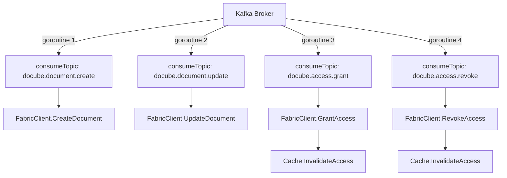
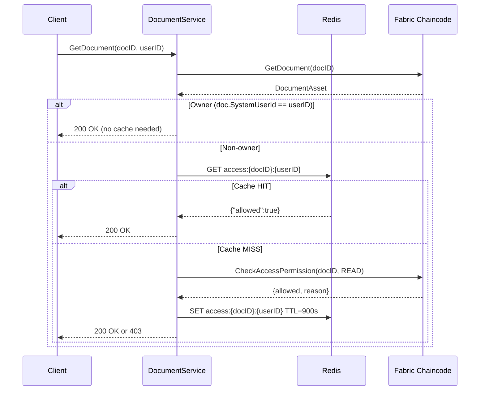
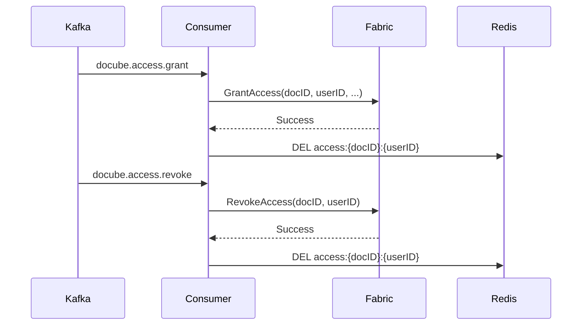
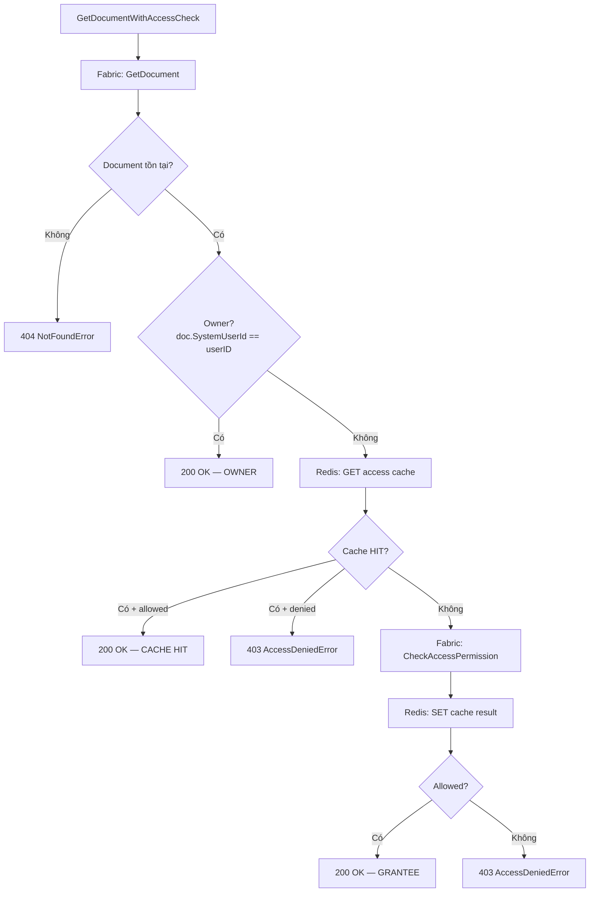
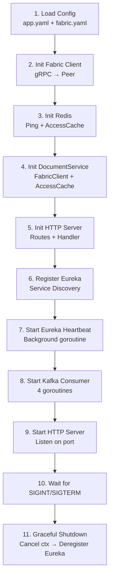

# BLOCKCHAIN SERVICE - Tài liệu Chi tiết

**Phiên bản tài liệu:** 1.0
**Cập nhật lần cuối:** 2026-03-10

---

## Mục đích
Tài liệu này mô tả chi tiết Blockchain Service (Go) — dịch vụ cầu nối giữa API Gateway và Hyperledger Fabric chaincode. Bao gồm kiến trúc, luồng xử lý, Kafka consumer, cache layer (Redis), và cách tích hợp với hệ thống.

## Phạm vi
- Kiến trúc và cấu trúc thư mục
- Fabric Client — kết nối và giao tiếp với chaincode
- HTTP API — endpoints và xử lý request
- Kafka Consumer — xử lý sự kiện bất đồng bộ
- Redis Cache — cache access control data
- Luồng xử lý end-to-end

## Đối tượng
- Backend developers
- DevOps engineers
- QA Engineers

## Tài liệu liên quan
- [CODE_ARCHITECTURE_VI.md](CODE_ARCHITECTURE_VI.md) — Kiến trúc chaincode
- [FUNCTION_FLOWS_VI.md](FUNCTION_FLOWS_VI.md) — Luồng chức năng chaincode
- [PERMISSION_MATRIX_VI.md](PERMISSION_MATRIX_VI.md) — Ma trận quyền

---

## 1. Cấu trúc Thư mục

```
docube_blockchain_service/
├── cmd/
│   └── server/
│       └── main.go                 # Entry point — khởi tạo và kết nối tất cả components
├── config/
│   ├── app.yaml                    # Cấu hình ứng dụng (App, Eureka, Kafka, Redis)
│   └── fabric.yaml                 # Cấu hình kết nối Fabric network
├── internal/
│   ├── cache/
│   │   ├── redis.go                # Redis client wrapper (Get, Set, Del)
│   │   └── access_cache.go         # Cache logic cho access permission checks
│   ├── config/
│   │   └── config.go               # Load cấu hình từ YAML + env overrides
│   ├── eureka/
│   │   └── client.go               # Eureka service discovery client
│   ├── fabric/
│   │   └── client/
│   │       ├── client.go           # Fabric Gateway SDK wrapper + models + read ops
│   │       └── write.go            # Fabric write transactions (Create, Update, Grant, Revoke)
│   ├── kafka/
│   │   ├── consumer.go             # Kafka consumer — 4 topic handlers
│   │   ├── models.go               # Kafka message payload structs
│   │   └── doc.go                  # Package documentation
│   ├── middleware/
│   │   └── middleware.go           # HTTP middleware
│   ├── service/
│   │   ├── document_service.go     # Business logic — access check + cache
│   │   └── service.go              # Package documentation
│   └── transport/
│       ├── grpc/
│       │   └── handler.go          # gRPC handler (reserved)
│       └── http/
│           └── handler.go          # HTTP request handlers + routes
├── go.mod
└── go.sum
```

---

## 2. Sơ đồ Kiến trúc

```mermaid
graph TD
    subgraph "Client"
        FE[Frontend / Gateway]
    end

    subgraph "Blockchain Service"
        HTTP[HTTP Handler<br/>GET /documents/{id}]
        SVC[DocumentService<br/>Access Check + Cache]
        CACHE[Redis Cache<br/>access:{docId}:{userId}]
        FC[Fabric Client<br/>gRPC → Peer]
        KAFKA[Kafka Consumer<br/>4 topics]
    end

    subgraph "External"
        FABRIC[Hyperledger Fabric<br/>Chaincode]
        REDIS[(Redis)]
        KAFKABROKER[Kafka Broker]
        EUREKA[Eureka Server]
    end

    FE -->|HTTP + X-User-Id| HTTP
    HTTP --> SVC
    SVC -->|cache check| CACHE
    CACHE --> REDIS
    SVC -->|blockchain query| FC
    FC -->|gRPC| FABRIC

    KAFKABROKER -->|events| KAFKA
    KAFKA -->|write txs| FC
    KAFKA -->|invalidate| CACHE

    HTTP -.->|register| EUREKA
```

---

## 3. Cấu hình (config/)

### 3.1 app.yaml

```yaml
app:
  name: fabric-gateway-service
  port: 8081
  env: dev

eureka:
  server_url: http://172.31.16.1:9000/eureka
  heartbeat_interval: 30
  retry_interval: 5

kafka:
  brokers:
    - "172.31.16.1:7092"
  group_id: "blockchain-service-group"
  sasl_enabled: true
  sasl_username: "horob1"
  sasl_password: "***"

redis:
  addr: "172.31.16.1:6379"
  password: "***"
  db: 1              # db=0 được Gateway sử dụng
  ttl: 900           # 15 phút
```

### 3.2 Environment Variable Overrides

| Biến | Mô tả | Mặc định |
|------|-------|----------|
| `APP_NAME` | Tên dịch vụ | fabric-gateway-service |
| `APP_PORT` | Port HTTP | 8081 |
| `ENV` | Môi trường | dev |
| `EUREKA_SERVER_URL` | URL Eureka server | http://localhost:9000/eureka |
| `REDIS_ADDR` | Địa chỉ Redis | localhost:6379 |
| `REDIS_PASSWORD` | Mật khẩu Redis | 2410 |
| `REDIS_DB` | Database index | 1 |
| `REDIS_TTL` | Cache TTL (giây) | 900 |

---

## 4. Fabric Client (internal/fabric/client/)

### 4.1 Models

```go
// DocumentAsset — mirror chaincode DocumentAssetNFT
type DocumentAsset struct {
    AssetID, DocumentID, DocHash, HashAlgo string
    OwnerID, OwnerMSP, SystemUserId       string
    Version                                int64
    Status, CreatedAt, UpdatedAt           string
}

// AccessCheckResult — mirror chaincode AccessCheckResult
type AccessCheckResult struct {
    Allowed    bool
    Reason     string  // OWNER | GRANTED | NOT_GRANTED | DOC_NOT_FOUND | DOC_INACTIVE
    DocumentID string
    CallerID   string
    Action     string
}
```

### 4.2 Read Operations (client.go)

| Hàm | Chaincode call | Mô tả |
|-----|---------------|-------|
| `GetDocument(docID)` | `document:GetDocument` | Lấy document từ ledger |
| `CheckAccessPermission(docID, action)` | `access:CheckAccessPermission` | Kiểm tra quyền truy cập |
| `GetDocumentHistory(docID)` | `document:GetDocumentHistory` | Lấy lịch sử kiểm toán |

Tất cả dùng `EvaluateTransaction` (read-only, không tạo block mới).

### 4.3 Write Operations (write.go)

| Hàm | Chaincode call | Mô tả |
|-----|---------------|-------|
| `CreateDocument(docID, hash, algo, sysUserId)` | `document:CreateDocument` | Tạo document NFT |
| `UpdateDocument(docID, hash, algo, version)` | `document:UpdateDocument` | Cập nhật document hash |
| `GrantAccess(docID, granteeID, granteeMSP, sysUserId)` | `access:GrantAccess` | Cấp quyền truy cập |
| `RevokeAccess(docID, userID)` | `access:RevokeAccess` | Thu hồi quyền truy cập |

Tất cả dùng `SubmitTransaction` (tạo block mới, cần endorsement).

---

## 5. HTTP API (internal/transport/http/)

### 5.1 Endpoints

| Method | Path | Mô tả | Headers |
|--------|------|-------|---------|
| GET | `/api/v1/blockchain/documents/{id}` | Lấy document (có access check) | `X-User-Id` (bắt buộc) |
| GET | `/api/v1/blockchain/documents/{id}/history` | Lấy lịch sử document (có access check) | `X-User-Id` (bắt buộc) |
| GET | `/api/v1/blockchain/health` | Health check | — |

### 5.2 Response Format

```json
// Thành công (200)
{
  "data": { ... },
  "error": null
}

// Lỗi (403 / 404 / 500)
{
  "data": null,
  "error": {
    "code": "ACCESS_DENIED",
    "message": "access denied: NOT_GRANTED"
  }
}
```

### 5.3 Header Flow

```
Gateway inject headers:
  X-User-Id: "user-uuid-123"            ← từ JWT payload
  X-User-Permissions: "base64(...)"      ← permissions từ Auth-Service/Redis

HTTP Handler extract:
  userID = request.Header.Get("X-User-Id")
  documentID = URL path parameter
```

---

## 6. Kafka Consumer (internal/kafka/)

### 6.1 Topics và Handlers

| Topic | Handler | Fabric Call | Cache Action |
|-------|---------|-------------|-------------|
| `docube.document.create` | `handleCreateDocument` | `CreateDocument()` | — |
| `docube.document.update` | `handleUpdateDocument` | `UpdateDocument()` | — |
| `docube.access.grant` | `handleGrantAccess` | `GrantAccess()` | **Invalidate** `access:{docID}:{userID}` |
| `docube.access.revoke` | `handleRevokeAccess` | `RevokeAccess()` | **Invalidate** `access:{docID}:{userID}` |

### 6.2 Message Payloads

```json
// docube.document.create
{ "documentId": "doc-001", "docHash": "sha256...", "hashAlgo": "SHA256", "systemUserId": "user-uuid" }

// docube.document.update
{ "documentId": "doc-001", "newDocHash": "sha256...", "newHashAlgo": "SHA256", "expectedVersion": 1 }

// docube.access.grant
{ "documentId": "doc-001", "granteeUserId": "user-bob", "granteeUserMsp": "UserOrgMSP", "systemUserId": "user-alice" }

// docube.access.revoke
{ "documentId": "doc-001", "userId": "user-bob" }
```

### 6.3 Consumer Architecture



Mỗi topic chạy trên một goroutine riêng. Khi Kafka message được xử lý thành công, offset được commit. Khi xử lý thất bại, log error và vẫn commit (dead-letter queue có thể thêm sau).

---

## 7. Redis Cache Layer (internal/cache/)

### 7.1 Tại sao cần cache?

| Trường hợp | Trước cache | Sau cache |
|------------|-------------|-----------|
| Owner đọc document | 1 blockchain query | 1 blockchain query (không đổi) |
| Non-owner đọc document | **2 blockchain queries** | 1 blockchain + **0 cache hit** |
| Non-owner đọc lần 2+ | **2 blockchain queries** | 1 blockchain + **1 cache hit** |
| Đọc history (non-owner) | **3 blockchain queries** | 1 blockchain + 1 cache hit + 1 blockchain |

### 7.2 Cache Key Design

```
Format:  access:{documentID}:{userID}
Ví dụ:   access:doc-invoice-2024:user-b-uuid-456
Value:   {"allowed":true,"reason":"GRANTED"}
TTL:     900 giây (15 phút)
```

### 7.3 Cache Flow



### 7.4 Cache Invalidation



**Chiến lược invalidation:**
- **Event-driven**: Kafka consumer invalidate ngay sau khi blockchain transaction thành công
- **TTL fallback**: Nếu invalidation bị miss, cache tự hết hạn sau 15 phút
- **No stale data risk**: Grant/Revoke luôn đi qua cùng Kafka consumer → đảm bảo invalidation

### 7.5 Redis vs Gateway

| | Gateway (Spring) | Blockchain Service (Go) |
|---|---|---|
| Redis DB | `db=0` | `db=1` |
| Mục đích | Cache UserSession (permissions) | Cache access check results |
| TTL | 900s (15 phút) | 900s (15 phút) |
| Invalidation | TTL-based | Event-driven (Kafka) + TTL |

---

## 8. DocumentService — Business Logic (internal/service/)

### 8.1 GetDocumentWithAccessCheck



### 8.2 Error Types

| Error Type | HTTP Status | Khi nào |
|-----------|-------------|---------|
| `NotFoundError` | 404 | Document không tồn tại trên blockchain |
| `AccessDeniedError` | 403 | User không phải owner và không có AccessNFT active |
| `error` (generic) | 500 | Lỗi kết nối Fabric, Redis, etc. |

---

## 9. Khởi tạo Service (cmd/server/main.go)

### 9.1 Thứ tự khởi tạo



### 9.2 Dependency Injection

```go
// Fabric Client
fc := fabricClient.New(fabricConfig)

// Redis → AccessCache
redisClient := cache.NewRedisClient(redisConfig)
accessCache := cache.NewAccessCache(redisClient)

// Service (depends on Fabric + Cache)
documentService := service.NewDocumentService(fc, accessCache)

// HTTP Handler (depends on Service)
handler := httpTransport.NewHandler(documentService)

// Kafka Consumer (depends on Fabric + Cache)
kafkaConsumer := kafka.NewConsumer(kafkaCfg, fc, accessCache)
```

---

## 10. Luồng End-to-End

### 10.1 Đọc Document (Non-owner, Cache Miss)

```
1. Client → GET /api/v1/blockchain/documents/doc-001
   Header: X-User-Id: user-b-uuid

2. HTTP Handler → extract docID="doc-001", userID="user-b-uuid"

3. DocumentService.GetDocumentWithAccessCheck("doc-001", "user-b-uuid")

4. FabricClient.GetDocument("doc-001")
   → gRPC → Peer → Chaincode: document:GetDocument
   → return DocumentAsset { systemUserId: "user-a-uuid", ... }

5. Owner check: "user-b-uuid" != "user-a-uuid" → NOT OWNER

6. Redis GET "access:doc-001:user-b-uuid" → MISS

7. FabricClient.CheckAccessPermission("doc-001", "READ")
   → gRPC → Peer → Chaincode: access:CheckAccessPermission
   → return { allowed: true, reason: "GRANTED" }

8. Redis SET "access:doc-001:user-b-uuid" = {"allowed":true,"reason":"GRANTED"} TTL=900s

9. Return 200 OK with DocumentResponse
```

### 10.2 Cấp Quyền (Qua Kafka)

```
1. Auth-Service publish → Kafka topic: docube.access.grant
   Payload: { documentId: "doc-001", granteeUserId: "user-bob",
              granteeUserMsp: "UserOrgMSP", systemUserId: "user-bob" }

2. Kafka Consumer.handleGrantAccess()

3. FabricClient.GrantAccess("doc-001", "user-bob", "UserOrgMSP", "user-bob")
   → gRPC → Peer → Chaincode: access:GrantAccess
   → AccessNFT created on ledger
   → Timeline record appended (ACTION: ACCESS_GRANTED)

4. AccessCache.InvalidateAccess("doc-001", "user-bob")
   → Redis DEL "access:doc-001:user-bob"

5. Next read request → cache MISS → fresh blockchain query → cache SET
```

---

## 11. Dependencies (go.mod)

| Package | Version | Mục đích |
|---------|---------|----------|
| `github.com/hyperledger/fabric-gateway` | v1.7.1 | Fabric Gateway SDK — gRPC chaincode interaction |
| `github.com/redis/go-redis/v9` | v9.7.0 | Redis client cho Go |
| `github.com/segmentio/kafka-go` | v0.4.47 | Kafka consumer/producer |
| `google.golang.org/grpc` | v1.69.4 | gRPC transport cho Fabric |
| `gopkg.in/yaml.v3` | v3.0.1 | YAML config parser |

---

## Lịch sử Tài liệu

| Phiên bản | Ngày | Tác giả | Thay đổi |
|-----------|------|---------|----------|
| 1.0 | 2026-03-10 | Đội Docube | Tài liệu ban đầu — bao gồm Fabric Client, HTTP API, Kafka Consumer, Redis Cache |
