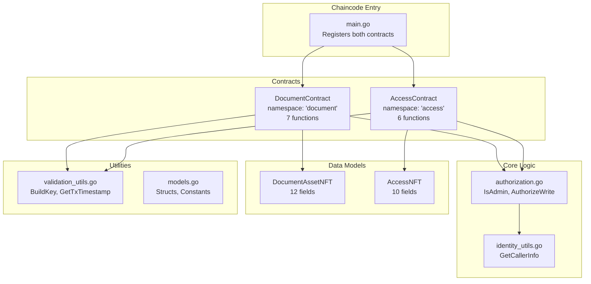
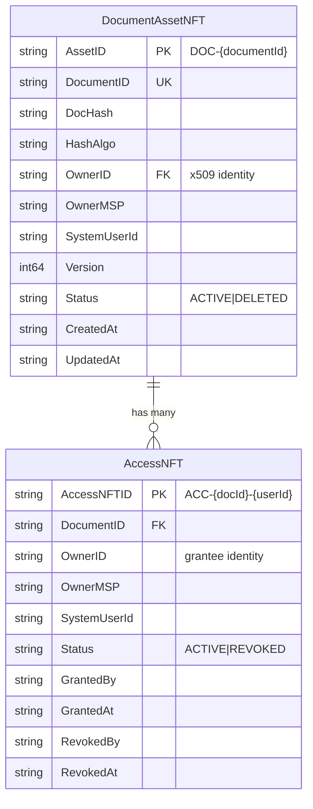
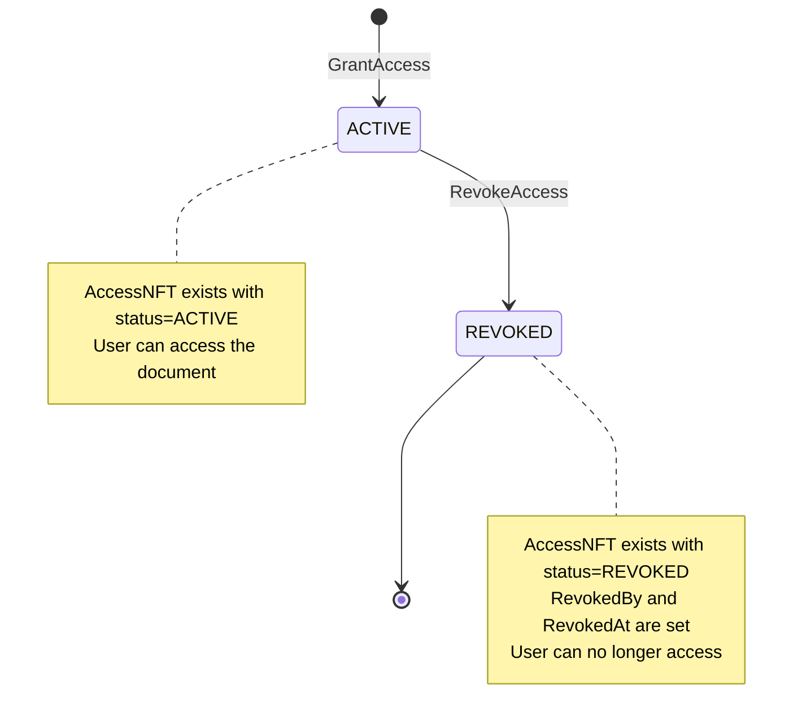
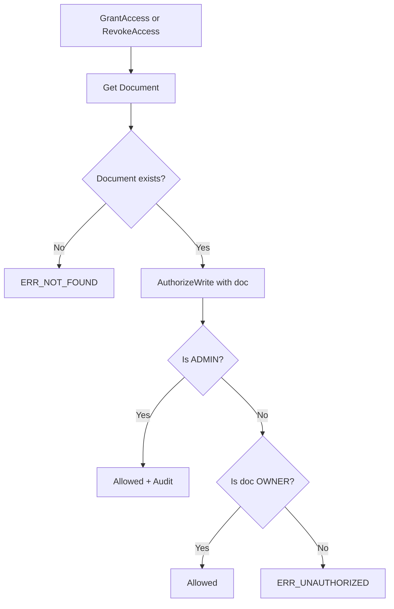

# CODE ARCHITECTURE - Docube Chaincode

**Document Version:** 2.0  
**Last Updated:** 2026-02-01

---

## Purpose
This document explains the code architecture and structure of the Docube chaincode, with detailed coverage of both DocumentContract and AccessContract.

## Scope
- Folder structure
- Multi-contract design (DocumentContract + AccessContract)
- Data models: DocumentAssetNFT & AccessNFT
- Separation of concerns
- Utility modules

## Audience
- Blockchain Developers
- Code Reviewers
- QA Engineers

## References
- [FUNCTION_FLOWS_EN.md](FUNCTION_FLOWS_EN.md)
- [PERMISSION_MATRIX_EN.md](PERMISSION_MATRIX_EN.md)

---

## 1. Folder Structure

```
chaincode/docube/
├── main.go                 # Entry point, registers 2 contracts
├── models.go               # Data models: DocumentAssetNFT, AccessNFT
├── authorization.go        # Authorization logic (User/Owner/Admin)
├── document_contract.go    # Document NFT operations (7 functions)
├── access_contract.go      # Access NFT operations (6 functions)
├── identity_utils.go       # Identity extraction utilities
├── validation_utils.go     # Validation and state utilities
├── go.mod                  # Go module definition
└── go.sum                  # Dependency checksums
```

---

## 2. Architecture Diagram



---

## 3. Multi-Contract Design

### 3.1 Contract Registration (main.go)

```go
func main() {
    // DocumentContract - namespace: "document"
    documentContract := new(DocumentContract)
    documentContract.Name = "document"
    documentContract.Info.Version = "1.0.0"
    documentContract.Info.Description = "Document NFT Management Contract"
    documentContract.Info.Title = "DocumentContract"

    // AccessContract - namespace: "access"
    accessContract := new(AccessContract)
    accessContract.Name = "access"
    accessContract.Info.Version = "1.0.0"
    accessContract.Info.Description = "Access Control NFT Management Contract"
    accessContract.Info.Title = "AccessContract"

    // Register both contracts
    chaincode, _ := contractapi.NewChaincode(documentContract, accessContract)
    chaincode.Start()
}
```

### 3.2 Contract Namespacing

| Contract | Namespace | Description | Functions |
|----------|-----------|-------------|-----------|
| DocumentContract | `document:` | Manages document NFT lifecycle | 7 |
| AccessContract | `access:` | Manages access control NFTs | 6 |

### 3.3 Function Invocation Format

```bash
# Document functions
peer chaincode invoke ... -c '{"function":"document:CreateDocument","Args":[...]}'

# Access functions
peer chaincode invoke ... -c '{"function":"access:GrantAccess","Args":[...]}'
```

---

## 4. Data Models (models.go)

### 4.1 DocumentAssetNFT (Lines 9-23)

Represents a document registered on the blockchain.

```go
type DocumentAssetNFT struct {
    AssetID      string `json:"assetId"`      // Unique: "DOC-{documentId}"
    DocumentID   string `json:"documentId"`   // User-provided ID
    DocHash      string `json:"docHash"`      // Content hash (SHA256)
    HashAlgo     string `json:"hashAlgo"`     // Hash algorithm used
    OwnerID      string `json:"ownerId"`      // x509 identity of owner
    OwnerMSP     string `json:"ownerMsp"`     // MSP ID of owner
    SystemUserId string `json:"systemUserId"` // App-level user ID
    Version      int64  `json:"version"`      // Optimistic lock version
    Status       string `json:"status"`       // "ACTIVE" | "DELETED"
    CreatedAt    string `json:"createdAt"`    // ISO8601 timestamp
    UpdatedAt    string `json:"updatedAt"`    // ISO8601 timestamp
}
```

| Field | Type | Description |
|-------|------|-------------|
| AssetID | string | Unique identifier format: `DOC-{documentId}` |
| DocumentID | string | User-provided document ID |
| DocHash | string | SHA256 hash of document content |
| HashAlgo | string | Algorithm used for hashing |
| OwnerID | string | x509 identity extracted from certificate |
| OwnerMSP | string | MSP ID of owner organization |
| SystemUserId | string | Application-layer user ID |
| Version | int64 | Version number for optimistic locking |
| Status | string | ACTIVE or DELETED |
| CreatedAt | string | ISO8601 creation timestamp |
| UpdatedAt | string | ISO8601 last update timestamp |

### 4.2 AccessNFT (Lines 25-38)

Represents an access token granting document access to a user.

```go
type AccessNFT struct {
    AccessNFTID  string `json:"accessNftId"`   // Unique: "ACC-{docId}-{userId}"
    DocumentID   string `json:"documentId"`    // Referenced document ID
    OwnerID      string `json:"ownerId"`       // Access holder's identity
    OwnerMSP     string `json:"ownerMsp"`      // Access holder's MSP
    SystemUserId string `json:"systemUserId"`  // App-level user ID
    Status       string `json:"status"`        // "ACTIVE" | "REVOKED"
    GrantedBy    string `json:"grantedBy"`     // Who granted the access
    GrantedAt    string `json:"grantedAt"`     // When access was granted
    RevokedBy    string `json:"revokedBy"`     // Who revoked (if revoked)
    RevokedAt    string `json:"revokedAt"`     // When revoked (if revoked)
}
```

| Field | Type | Description |
|-------|------|-------------|
| AccessNFTID | string | Unique identifier format: `ACC-{docId}-{userId}` |
| DocumentID | string | ID of the document being accessed |
| OwnerID | string | Identity of the user receiving access |
| OwnerMSP | string | MSP ID of the access holder |
| SystemUserId | string | Application-layer user ID |
| Status | string | ACTIVE or REVOKED |
| GrantedBy | string | Identity who granted the access |
| GrantedAt | string | ISO8601 timestamp when granted |
| RevokedBy | string | Identity who revoked (optional) |
| RevokedAt | string | ISO8601 timestamp when revoked (optional) |

### 4.3 Relationship Diagram



### 4.4 Ledger Key Formats

| Asset | Key Format | Example |
|-------|------------|---------|
| Document | `DOC~{documentId}` | `DOC~invoice-001` |
| Access | `ACC~{documentId}~{userId}` | `ACC~invoice-001~user-123` |

---

## 5. DocumentContract (document_contract.go)

### 5.1 Contract Overview

| Function | Lines | Authorization | Description |
|----------|-------|---------------|-------------|
| CreateDocument | 20-85 | Any user | Create new document NFT |
| UpdateDocument | 87-166 | ADMIN/OWNER | Update document hash |
| TransferOwnership | 168-237 | ADMIN/OWNER | Transfer to new owner |
| SoftDeleteDocument | 239-308 | ADMIN/OWNER | Mark as DELETED |
| GetDocument | 314-335 | Any user | Retrieve single document |
| GetAllDocuments | 337-370 | Any user | List all active documents |
| GetDocumentHistory | 372-417 | Any user | Get audit trail |

### 5.2 Write Operations

| Operation | Creates Event | Admin Audit |
|-----------|--------------|-------------|
| CreateDocument | DocumentCreated | No |
| UpdateDocument | DocumentUpdated | Yes (if admin) |
| TransferOwnership | DocumentTransferred | Yes (if admin) |
| SoftDeleteDocument | DocumentDeleted | Yes (if admin) |

---

## 6. AccessContract (access_contract.go)

### 6.1 Contract Overview

| Function | Lines | Authorization | Description |
|----------|-------|---------------|-------------|
| GrantAccess | 20-115 | ADMIN/OWNER | Grant access to user |
| RevokeAccess | 117-203 | ADMIN/OWNER | Revoke access from user |
| GetAccess | 209-232 | Any user | Get single access record |
| GetAllAccessByDocument | 234-268 | Any user | List all access for document |
| GetAllAccessByUser | 270-305 | Any user | List all access for user |
| GetAccessHistory | 307-353 | Any user | Get access audit trail |

### 6.2 Access Lifecycle



### 6.3 Write Operations

| Operation | Creates Event | Admin Audit |
|-----------|--------------|-------------|
| GrantAccess | AccessGranted | Yes (if admin) |
| RevokeAccess | AccessRevoked | Yes (if admin) |

### 6.4 Query Operations (CouchDB)

| Operation | Query Type | Filter |
|-----------|------------|--------|
| GetAccess | Key lookup | documentId + userId |
| GetAllAccessByDocument | Rich query | `{"documentId": "..."}` |
| GetAllAccessByUser | Rich query | `{"ownerId": "...", "status": "ACTIVE"}` |
| GetAccessHistory | History API | GetHistoryForKey |

---

## 7. Authorization Layer (authorization.go)

### 7.1 Authorization for Document vs Access

| Operation | Checks Document Owner? | Creates Access? |
|-----------|------------------------|-----------------|
| UpdateDocument | Yes | No |
| SoftDeleteDocument | Yes | No |
| TransferOwnership | Yes | No |
| **GrantAccess** | **Yes (doc owner)** | **Yes (AccessNFT)** |
| **RevokeAccess** | **Yes (doc owner)** | **No (updates)** |

> **Key Point:** GrantAccess and RevokeAccess check if the caller is the **document owner**, not the access owner. This ensures only document owners can manage access.

### 7.2 Authorization Flow for AccessContract



---

## 8. Events

### 8.1 Event Types

| Event | Source | Payload |
|-------|--------|---------|
| DocumentCreated | CreateDocument | assetId, documentId, actorId, timestamp |
| DocumentUpdated | UpdateDocument | assetId, documentId, actorId, timestamp |
| DocumentTransferred | TransferOwnership | assetId, documentId, actorId, timestamp |
| DocumentDeleted | SoftDeleteDocument | assetId, documentId, actorId, timestamp |
| **AccessGranted** | **GrantAccess** | accessNftId, documentId, actorId, timestamp |
| **AccessRevoked** | **RevokeAccess** | accessNftId, documentId, actorId, timestamp |
| AdminAction | Any admin write | Full audit payload |

### 8.2 Event Payload Structures

```go
// Standard event payload
type EventPayload struct {
    AssetID    string `json:"assetId"`    // DOC-xxx or ACC-xxx
    DocumentID string `json:"documentId"`
    ActorID    string `json:"actorId"`
    Timestamp  string `json:"timestamp"`
}

// Admin audit payload
type AdminAuditPayload struct {
    AssetID    string `json:"assetId"`
    DocumentID string `json:"documentId"`
    Action     string `json:"action"`     // GrantAccess, RevokeAccess, etc.
    ActorID    string `json:"actorId"`
    ActorMSP   string `json:"actorMsp"`
    Role       string `json:"role"`       // ADMIN
    Reason     string `json:"reason"`
    Timestamp  string `json:"timestamp"`
    TxID       string `json:"txId"`
}
```

---

## 9. Constants Summary (models.go)

### 9.1 Status Constants

```go
const (
    StatusActive  = "ACTIVE"   // Document/Access is active
    StatusDeleted = "DELETED"  // Document is soft-deleted
    StatusRevoked = "REVOKED"  // Access is revoked
)
```

### 9.2 Error Constants

| Error Code | Used By | Meaning |
|------------|---------|---------|
| ERR_NOT_FOUND | All | Asset not found |
| ERR_ALREADY_EXISTS | Create/Grant | Asset already exists |
| ERR_UNAUTHORIZED | Write ops | Not owner/admin |
| ERR_INVALID_STATE | Write ops | Asset deleted/revoked |
| ERR_VERSION_MISMATCH | UpdateDocument | Optimistic lock failed |

### 9.3 Key Prefixes

```go
const (
    DocKeyPrefix    = "DOC"  // Document keys: DOC~{documentId}
    AccessKeyPrefix = "ACC"  // Access keys: ACC~{documentId}~{userId}
)
```

---

## 10. Design Principles

| Principle | Implementation |
|-----------|----------------|
| **Multi-Contract** | Separate contracts for document and access |
| **NFT Pattern** | Both DocumentAssetNFT and AccessNFT are unique tokens |
| **Soft Delete** | Status changes, no physical deletion |
| **Auditability** | Full history via GetHistoryForKey |
| **Optimistic Locking** | Version checks on DocumentAssetNFT |
| **Rich Queries** | CouchDB selectors for filtering |

---

## Document History

| Version | Date | Author | Changes |
|---------|------|--------|---------|
| 1.0 | 2026-02-01 | Docube Team | Initial document |
| 2.0 | 2026-02-01 | Docube Team | Added full AccessNFT documentation |
