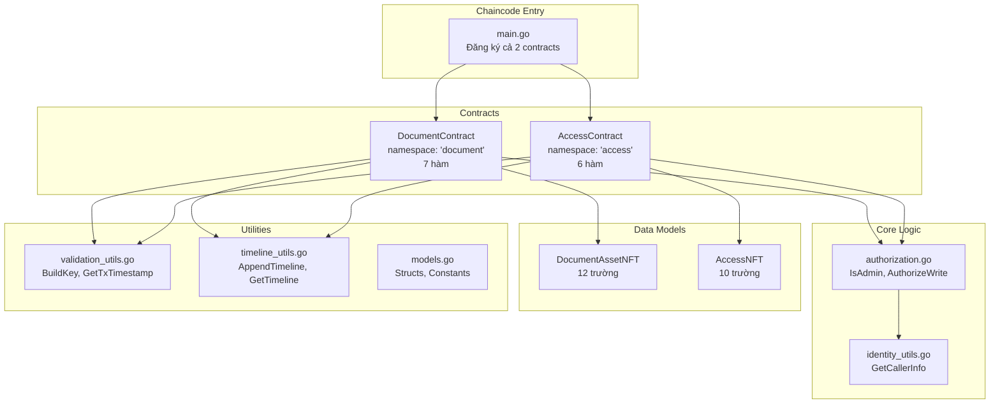
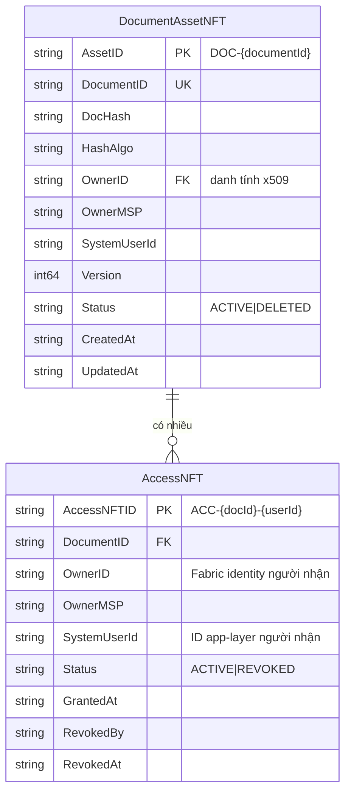
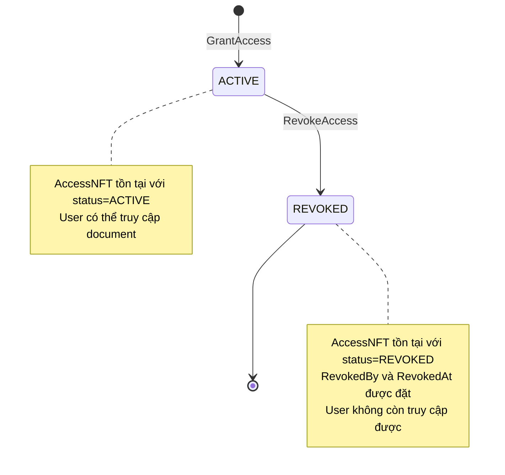
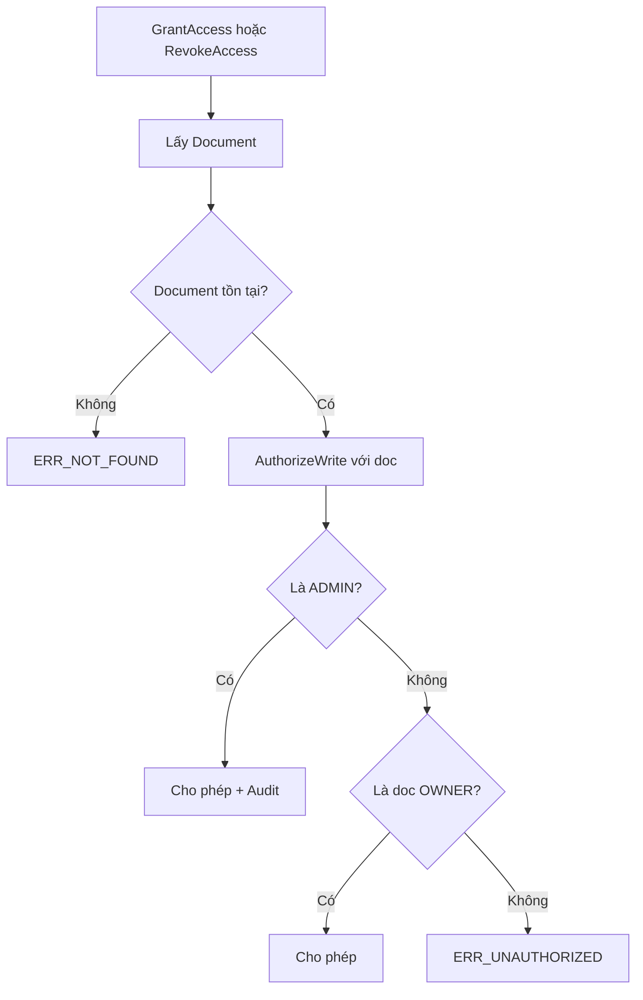

# KIẾN TRÚC CODE - Docube Chaincode

**Phiên bản tài liệu:** 3.0
**Cập nhật lần cuối:** 2026-03-10

---

## Mục đích
Tài liệu này giải thích kiến trúc và cấu trúc code của Docube chaincode, với chi tiết đầy đủ về cả DocumentContract và AccessContract.

## Phạm vi
- Cấu trúc thư mục
- Thiết kế multi-contract (DocumentContract + AccessContract)
- Data models: DocumentAssetNFT & AccessNFT
- Phân tách trách nhiệm
- Các module tiện ích

## Đối tượng
- Lập trình viên Blockchain
- Code Reviewers
- QA Engineers

## Tài liệu liên quan
- [FUNCTION_FLOWS_VI.md](FUNCTION_FLOWS_VI.md)
- [PERMISSION_MATRIX_VI.md](PERMISSION_MATRIX_VI.md)
- [BLOCKCHAIN_SERVICE_VI.md](BLOCKCHAIN_SERVICE_VI.md)

---

## 1. Cấu trúc Thư mục

```
chaincode/docube/
├── main.go                 # Điểm vào, đăng ký 2 contracts
├── models.go               # Data models: DocumentAssetNFT, AccessNFT
├── authorization.go        # Logic authorization (User/Owner/Admin)
├── document_contract.go    # Các thao tác Document NFT (7 hàm)
├── access_contract.go      # Các thao tác Access NFT (6 hàm)
├── identity_utils.go       # Tiện ích trích xuất danh tính
├── validation_utils.go     # Tiện ích validation và state
├── timeline_utils.go       # Tiện ích audit timeline
├── go.mod                  # Định nghĩa Go module
└── go.sum                  # Checksums dependencies
```

---

## 2. Sơ đồ Kiến trúc



---

## 3. Thiết kế Multi-Contract

### 3.1 Đăng ký Contract (main.go)

```go
func main() {
    // DocumentContract - namespace: "document"
    documentContract := new(DocumentContract)
    documentContract.Name = "document"
    documentContract.Info.Version = "1.0.0"
    documentContract.Info.Description = "Document NFT Management Contract"
    documentContract.Info.Title = "DocumentContract"

    // AccessContract - namespace: "access"
    accessContract := new(AccessContract)
    accessContract.Name = "access"
    accessContract.Info.Version = "1.0.0"
    accessContract.Info.Description = "Access Control NFT Management Contract"
    accessContract.Info.Title = "AccessContract"

    // Đăng ký cả 2 contracts
    chaincode, _ := contractapi.NewChaincode(documentContract, accessContract)
    chaincode.Start()
}
```

### 3.2 Namespacing Contract

| Contract | Namespace | Mô tả | Số hàm |
|----------|-----------|-------|--------|
| DocumentContract | `document:` | Quản lý vòng đời document NFT | 7 |
| AccessContract | `access:` | Quản lý access control NFTs | 6 |

### 3.3 Định dạng Gọi hàm

```bash
# Hàm Document
peer chaincode invoke ... -c '{"function":"document:CreateDocument","Args":[...]}'

# Hàm Access
peer chaincode invoke ... -c '{"function":"access:GrantAccess","Args":[...]}'
```

---

## 4. Data Models (models.go)

### 4.1 DocumentAssetNFT (Dòng 9-23)

Đại diện cho một tài liệu được đăng ký trên blockchain.

```go
type DocumentAssetNFT struct {
    AssetID      string `json:"assetId"`      // Duy nhất: "DOC-{documentId}"
    DocumentID   string `json:"documentId"`   // ID do user cung cấp
    DocHash      string `json:"docHash"`      // Hash nội dung (SHA256)
    HashAlgo     string `json:"hashAlgo"`     // Thuật toán hash
    OwnerID      string `json:"ownerId"`      // Danh tính x509 của owner
    OwnerMSP     string `json:"ownerMsp"`     // MSP ID của owner
    SystemUserId string `json:"systemUserId"` // ID user tầng ứng dụng
    Version      int64  `json:"version"`      // Phiên bản khóa lạc quan
    Status       string `json:"status"`       // "ACTIVE" | "DELETED"
    CreatedAt    string `json:"createdAt"`    // Timestamp ISO8601
    UpdatedAt    string `json:"updatedAt"`    // Timestamp ISO8601
}
```

| Trường | Kiểu | Mô tả |
|--------|------|-------|
| AssetID | string | Định danh duy nhất: `DOC-{documentId}` |
| DocumentID | string | ID tài liệu do user cung cấp |
| DocHash | string | Hash SHA256 của nội dung |
| HashAlgo | string | Thuật toán hash sử dụng |
| OwnerID | string | Danh tính x509 trích xuất từ chứng chỉ |
| OwnerMSP | string | MSP ID của tổ chức owner |
| SystemUserId | string | ID user tầng ứng dụng |
| Version | int64 | Số phiên bản cho khóa lạc quan |
| Status | string | ACTIVE hoặc DELETED |
| CreatedAt | string | Timestamp tạo ISO8601 |
| UpdatedAt | string | Timestamp cập nhật cuối ISO8601 |

### 4.2 AccessNFT (Dòng 25-38)

Đại diện cho token cấp quyền truy cập tài liệu cho user.
Thông tin người cấp quyền (granter) được ghi trong Timeline record, không lưu trong AccessNFT.

```go
type AccessNFT struct {
    AccessNFTID  string `json:"accessNftId"`   // Duy nhất: "ACC-{docId}-{userId}"
    DocumentID   string `json:"documentId"`    // ID document tham chiếu
    OwnerID      string `json:"ownerId"`       // Fabric identity người nhận quyền (dùng cho CheckAccessPermission)
    OwnerMSP     string `json:"ownerMsp"`      // MSP người nhận quyền
    SystemUserId string `json:"systemUserId"`  // ID user tầng ứng dụng của người nhận quyền
    Status       string `json:"status"`        // "ACTIVE" | "REVOKED"
    GrantedAt    string `json:"grantedAt"`     // Khi nào cấp quyền
    RevokedBy    string `json:"revokedBy"`     // Ai thu hồi (nếu có)
    RevokedAt    string `json:"revokedAt"`     // Khi nào thu hồi (nếu có)
}
```

| Trường | Kiểu | Mô tả |
|--------|------|-------|
| AccessNFTID | string | Định danh duy nhất: `ACC-{docId}-{userId}` |
| DocumentID | string | ID của document được truy cập |
| OwnerID | string | Fabric identity của user nhận quyền (dùng cho `CheckAccessPermission`) |
| OwnerMSP | string | MSP ID của người nhận quyền |
| SystemUserId | string | ID user tầng ứng dụng của người nhận quyền |
| Status | string | ACTIVE hoặc REVOKED |
| GrantedAt | string | Timestamp ISO8601 khi cấp |
| RevokedBy | string | Danh tính người thu hồi (tùy chọn) |
| RevokedAt | string | Timestamp ISO8601 khi thu hồi (tùy chọn) |

> **Lưu ý:** Trường `GrantedBy` đã bị loại bỏ vì caller chaincode luôn là service account (cố định). Thông tin granter được theo dõi qua Timeline record (`ActorID`, `ActorMSP`, `TxID`).

### 4.3 Sơ đồ Quan hệ



### 4.4 Định dạng Ledger Key

| Asset | Định dạng Key | Ví dụ |
|-------|---------------|-------|
| Document | `DOC~{documentId}` | `DOC~invoice-001` |
| Access | `ACC~{documentId}~{userId}` | `ACC~invoice-001~user-123` |

---

## 5. DocumentContract (document_contract.go)

### 5.1 Tổng quan Contract

| Hàm | Dòng | Authorization | Mô tả |
|-----|------|---------------|-------|
| CreateDocument | 20-85 | Bất kỳ user | Tạo document NFT mới |
| UpdateDocument | 87-166 | ADMIN/OWNER | Cập nhật hash document |
| TransferOwnership | 168-237 | ADMIN/OWNER | Chuyển cho owner mới |
| SoftDeleteDocument | 239-308 | ADMIN/OWNER | Đánh dấu DELETED |
| GetDocument | 314-335 | Bất kỳ user | Lấy một document |
| GetAllDocuments | 337-370 | Bất kỳ user | Liệt kê tất cả documents active |
| GetDocumentHistory | 372-417 | Bất kỳ user | Lấy lịch sử kiểm toán |

### 5.2 Các thao tác Write

| Thao tác | Tạo Event | Admin Audit |
|----------|-----------|-------------|
| CreateDocument | DocumentCreated | Không |
| UpdateDocument | DocumentUpdated | Có (nếu admin) |
| TransferOwnership | DocumentTransferred | Có (nếu admin) |
| SoftDeleteDocument | DocumentDeleted | Có (nếu admin) |

---

## 6. AccessContract (access_contract.go)

### 6.1 Tổng quan Contract

| Hàm | Authorization | Mô tả |
|-----|---------------|-------|
| GrantAccess | ADMIN/OWNER | Cấp quyền truy cập cho user |
| RevokeAccess | ADMIN/OWNER | Thu hồi quyền từ user |
| GetAccess | Bất kỳ user | Lấy một bản ghi access |
| GetAllAccessByDocument | Bất kỳ user | Liệt kê quyền cho document |
| GetAllAccessByUser | Bất kỳ user | Liệt kê quyền của user |
| GetAccessHistory | Bất kỳ user | Lấy lịch sử access |
| CheckAccessPermission | Bất kỳ user | Kiểm tra quyền truy cập (read-only) |
| GetDocumentTimeline | Bất kỳ user | Lấy audit timeline của document |

### 6.2 Vòng đời Access



### 6.3 Các thao tác Write

| Thao tác | Tạo Event | Admin Audit |
|----------|-----------|-------------|
| GrantAccess | AccessGranted | Có (nếu admin) |
| RevokeAccess | AccessRevoked | Có (nếu admin) |

### 6.4 Query Operations (CouchDB)

| Thao tác | Loại Query | Filter |
|----------|------------|--------|
| GetAccess | Key lookup | documentId + userId |
| GetAllAccessByDocument | Rich query | `{"documentId": "..."}` |
| GetAllAccessByUser | Rich query | `{"ownerId": "...", "status": "ACTIVE"}` |
| GetAccessHistory | History API | GetHistoryForKey |

---

## 7. Tầng Authorization (authorization.go)

### 7.1 Authorization cho Document vs Access

| Thao tác | Kiểm tra Document Owner? | Tạo Access? |
|----------|--------------------------|-------------|
| UpdateDocument | Có | Không |
| SoftDeleteDocument | Có | Không |
| TransferOwnership | Có | Không |
| **GrantAccess** | **Có (doc owner)** | **Có (AccessNFT)** |
| **RevokeAccess** | **Có (doc owner)** | **Không (cập nhật)** |

> **Điểm quan trọng:** GrantAccess và RevokeAccess kiểm tra caller là **document owner**, không phải access owner. Điều này đảm bảo chỉ document owners mới có thể quản lý access.

### 7.2 Luồng Authorization cho AccessContract



---

## 8. Events

### 8.1 Các loại Event

| Event | Nguồn | Payload |
|-------|-------|---------|
| DocumentCreated | CreateDocument | assetId, documentId, actorId, timestamp |
| DocumentUpdated | UpdateDocument | assetId, documentId, actorId, timestamp |
| DocumentTransferred | TransferOwnership | assetId, documentId, actorId, timestamp |
| DocumentDeleted | SoftDeleteDocument | assetId, documentId, actorId, timestamp |
| **AccessGranted** | **GrantAccess** | accessNftId, documentId, actorId, timestamp |
| **AccessRevoked** | **RevokeAccess** | accessNftId, documentId, actorId, timestamp |
| AdminAction | Bất kỳ admin write | Payload kiểm toán đầy đủ |

### 8.2 Cấu trúc Event Payload

```go
// Payload event tiêu chuẩn
type EventPayload struct {
    AssetID    string `json:"assetId"`    // DOC-xxx hoặc ACC-xxx
    DocumentID string `json:"documentId"`
    ActorID    string `json:"actorId"`
    Timestamp  string `json:"timestamp"`
}

// Payload kiểm toán admin
type AdminAuditPayload struct {
    AssetID    string `json:"assetId"`
    DocumentID string `json:"documentId"`
    Action     string `json:"action"`     // GrantAccess, RevokeAccess, v.v.
    ActorID    string `json:"actorId"`
    ActorMSP   string `json:"actorMsp"`
    Role       string `json:"role"`       // ADMIN
    Reason     string `json:"reason"`
    Timestamp  string `json:"timestamp"`
    TxID       string `json:"txId"`
}
```

---

## 9. Tóm tắt Constants (models.go)

### 9.1 Status Constants

```go
const (
    StatusActive  = "ACTIVE"   // Document/Access đang hoạt động
    StatusDeleted = "DELETED"  // Document đã xóa mềm
    StatusRevoked = "REVOKED"  // Access đã thu hồi
)
```

### 9.2 Error Constants

| Mã lỗi | Sử dụng bởi | Ý nghĩa |
|--------|-------------|---------|
| ERR_NOT_FOUND | Tất cả | Asset không tìm thấy |
| ERR_ALREADY_EXISTS | Create/Grant | Asset đã tồn tại |
| ERR_UNAUTHORIZED | Write ops | Không phải owner/admin |
| ERR_INVALID_STATE | Write ops | Asset đã deleted/revoked |
| ERR_VERSION_MISMATCH | UpdateDocument | Khóa lạc quan thất bại |

### 9.3 Key Prefixes

```go
const (
    DocKeyPrefix      = "DOC"     // Document keys: DOC~{documentId}
    AccessKeyPrefix   = "ACC"     // Access keys: ACC~{documentId}~{userId}
    TimelineKeyPrefix = "DOCLOG"  // Timeline keys: DOCLOG~{documentId}~{txId}
)
```

### 9.4 Timeline Action Constants

```go
const (
    ActionDocumentCreated      = "DOCUMENT_CREATED"
    ActionDocumentUpdated      = "DOCUMENT_UPDATED"
    ActionOwnershipTransferred = "OWNERSHIP_TRANSFERRED"
    ActionDocumentDeleted      = "DOCUMENT_DELETED"
    ActionAccessGranted        = "ACCESS_GRANTED"
    ActionAccessRevoked        = "ACCESS_REVOKED"
)
```

---

## 10. Timeline Audit Log (timeline_utils.go)

Mỗi thao tác write trên document hoặc access đều ghi một `TimelineRecord` bất biến lên ledger.

### 10.1 Cấu trúc TimelineRecord

```go
type TimelineRecord struct {
    DocumentID string            `json:"documentId"` // Document liên quan
    TxID       string            `json:"txId"`       // Transaction ID
    Timestamp  string            `json:"timestamp"`  // ISO8601
    Action     string            `json:"action"`     // Timeline action constant
    ActorID    string            `json:"actorId"`    // Fabric identity của caller
    ActorMSP   string            `json:"actorMsp"`   // MSP của caller
    Details    map[string]string `json:"details"`    // Thông tin bổ sung
}
```

### 10.2 Cách hoạt động

| Thao tác | Action | Details |
|----------|--------|---------|
| CreateDocument | DOCUMENT_CREATED | docHash, hashAlgo |
| UpdateDocument | DOCUMENT_UPDATED | oldDocHash, newDocHash |
| TransferOwnership | OWNERSHIP_TRANSFERRED | oldOwner, newOwner |
| SoftDeleteDocument | DOCUMENT_DELETED | — |
| GrantAccess | ACCESS_GRANTED | granteeUserId, granteeUserMsp, systemUserId |
| RevokeAccess | ACCESS_REVOKED | userId |

### 10.3 Lưu trữ

- Key: `DOCLOG~{documentId}~{txId}` (composite key)
- Tự động sắp xếp theo thứ tự thời gian (TxID tăng dần)
- Truy vấn qua `GetDocumentTimeline(documentId)` → trả về `[]TimelineRecord`

> **Vai trò quan trọng:** Sau khi loại bỏ `GrantedBy` khỏi AccessNFT, Timeline record là nơi duy nhất theo dõi ai đã cấp/thu hồi quyền (thông qua `ActorID` + `ActorMSP`).

---

## 11. Nguyên tắc Thiết kế

| Nguyên tắc | Triển khai |
|------------|------------|
| **Multi-Contract** | Contracts riêng biệt cho document và access |
| **NFT Pattern** | Cả DocumentAssetNFT và AccessNFT đều là tokens duy nhất |
| **Soft Delete** | Thay đổi status, không xóa vật lý |
| **Kiểm toán được** | Lịch sử đầy đủ qua GetHistoryForKey |
| **Khóa lạc quan** | Kiểm tra version trên DocumentAssetNFT |
| **Rich Queries** | CouchDB selectors để lọc |
| **Timeline Audit** | Ghi lại mọi thao tác write với DOCLOG composite key |
| **Tách biệt State vs History** | AccessNFT chứa trạng thái hiện tại, Timeline chứa lịch sử sự kiện |

---

## Lịch sử Tài liệu

| Phiên bản | Ngày | Tác giả | Thay đổi |
|-----------|------|---------|----------|
| 1.0 | 2026-02-01 | Đội Docube | Tài liệu ban đầu |
| 2.0 | 2026-02-01 | Đội Docube | Thêm đầy đủ tài liệu AccessNFT |
| 3.0 | 2026-03-10 | Đội Docube | Loại bỏ GrantedBy, thêm Timeline Audit Log, thêm CheckAccessPermission/GetDocumentTimeline, liên kết BLOCKCHAIN_SERVICE_VI.md |
