# FUNCTION FLOWS - Docube Chaincode

**Document Version:** 2.0  
**Last Updated:** 2026-02-01

---

## Purpose
This document provides detailed step-by-step flow explanations for each business function in the Docube chaincode, covering both DocumentContract and AccessContract.

## Scope
- All Document operations (7 functions)
- All Access operations (6 functions)
- Authorization flow
- Error handling

## References
- [CODE_ARCHITECTURE_EN.md](CODE_ARCHITECTURE_EN.md)
- [PERMISSION_MATRIX_EN.md](PERMISSION_MATRIX_EN.md)

---

# Part 1: DocumentContract Functions

## 1. CreateDocument

**Location:** `document_contract.go` (Lines 20-85)  
**Authorization:** Any user (USER, OWNER, ADMIN)

### 1.1 Sequence Diagram

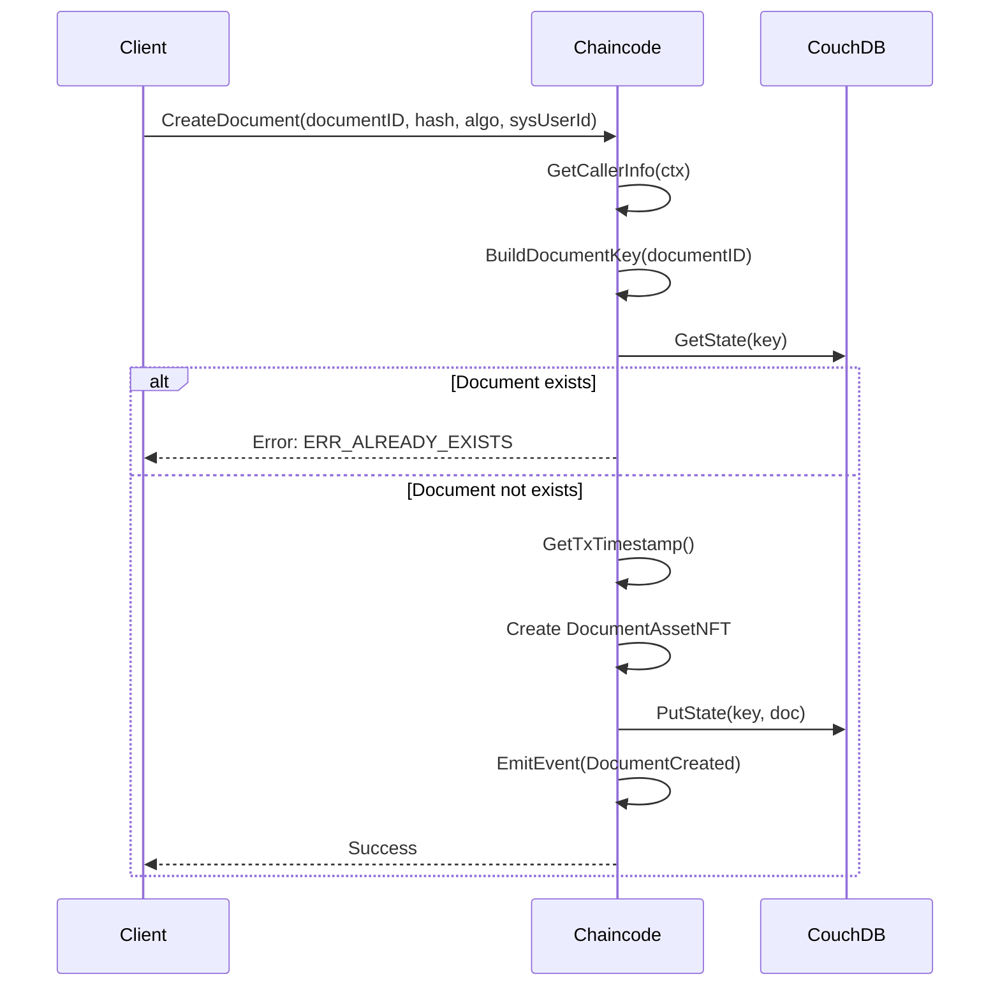

### 1.2 Step-by-Step Flow

| Step | Action | Code Reference |
|------|--------|----------------|
| 1 | Extract caller identity | `GetCallerInfo(ctx)` |
| 2 | Build ledger key | `BuildDocumentKey(ctx, documentID)` |
| 3 | Check existence | `GetDocument(ctx, key)` |
| 4 | Get timestamp | `GetTxTimestamp(ctx)` |
| 5 | Create NFT struct | Set OwnerID, Version=1, Status=ACTIVE |
| 6 | Save to ledger | `SaveState(ctx, key, doc)` |
| 7 | Emit event | `EmitEvent(ctx, EventDocumentCreated, ...)` |

---

## 2. UpdateDocument

**Location:** `document_contract.go` (Lines 87-166)  
**Authorization:** ADMIN or OWNER only

### 2.1 Sequence Diagram

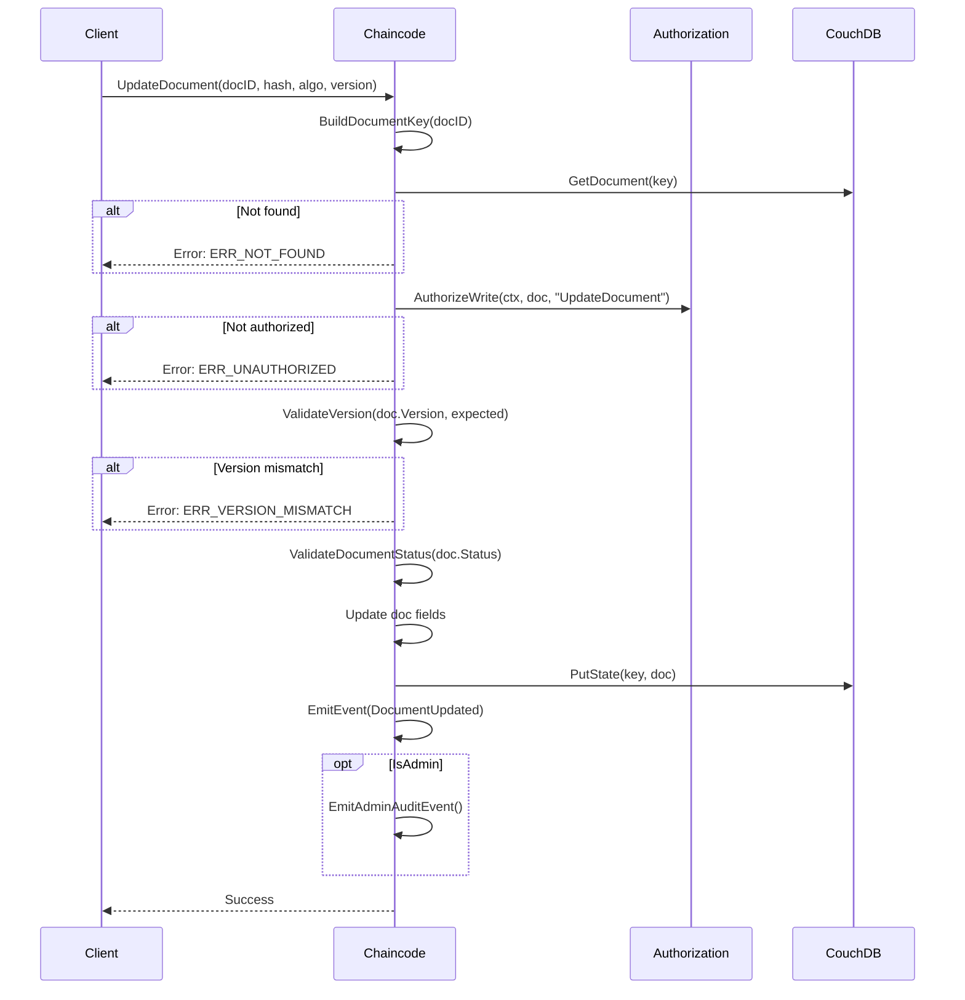

---

## 3. SoftDeleteDocument

**Location:** `document_contract.go` (Lines 239-308)  
**Authorization:** ADMIN or OWNER only

### 3.1 Flow Diagram

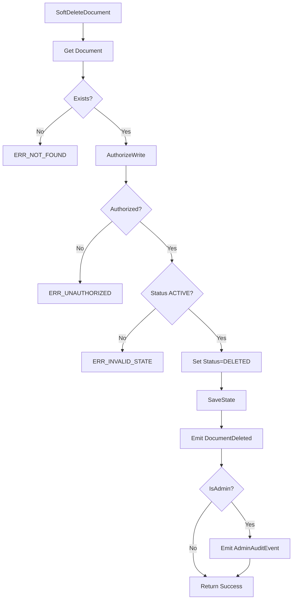

---

## 4. TransferOwnership

**Location:** `document_contract.go` (Lines 168-237)  
**Authorization:** ADMIN or OWNER only

### 4.1 Sequence Diagram

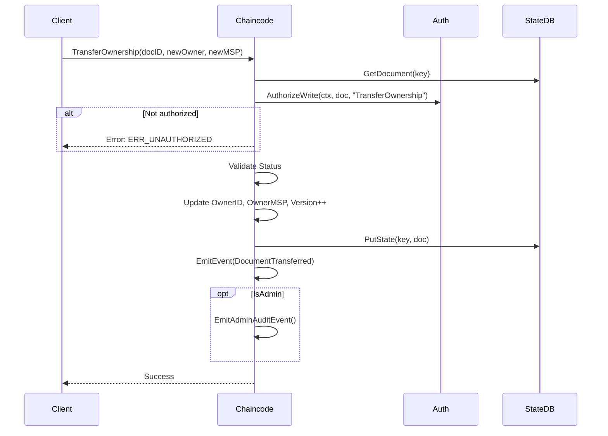

---

## 5-7. Query Operations

### 5. GetDocument

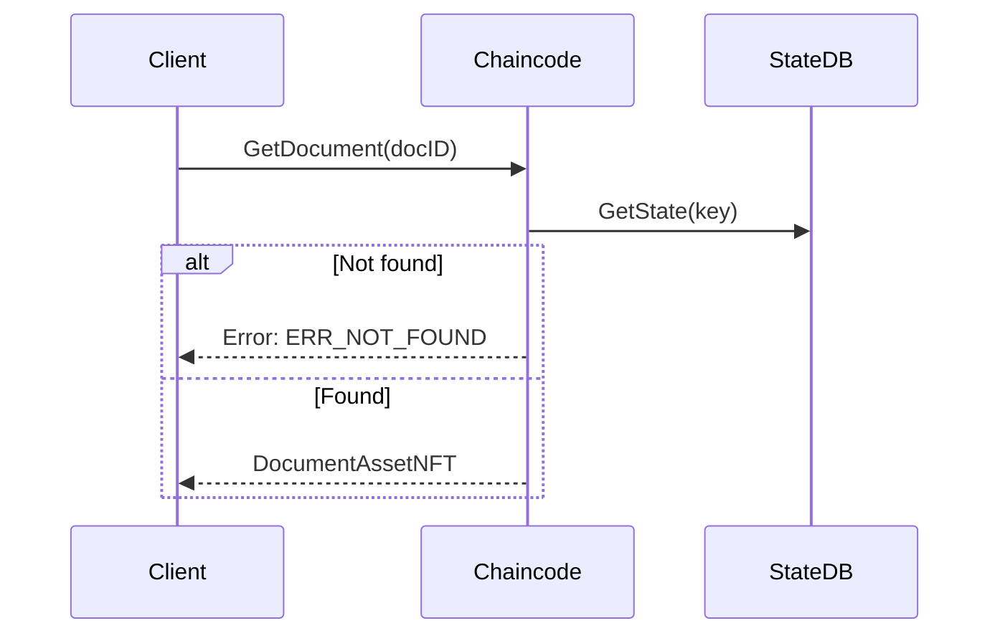

### 6. GetAllDocuments

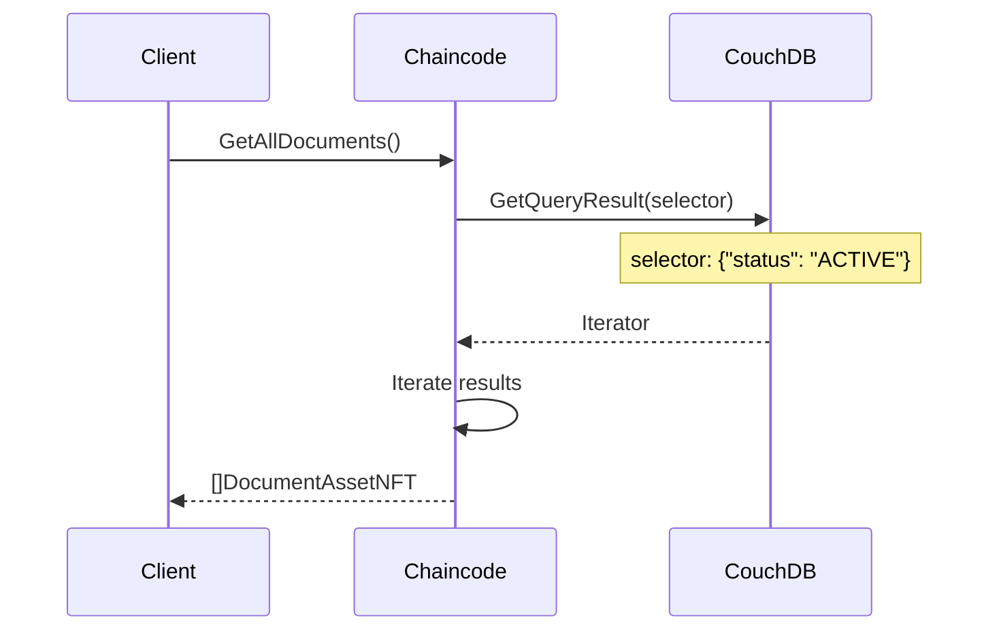

### 7. GetDocumentHistory

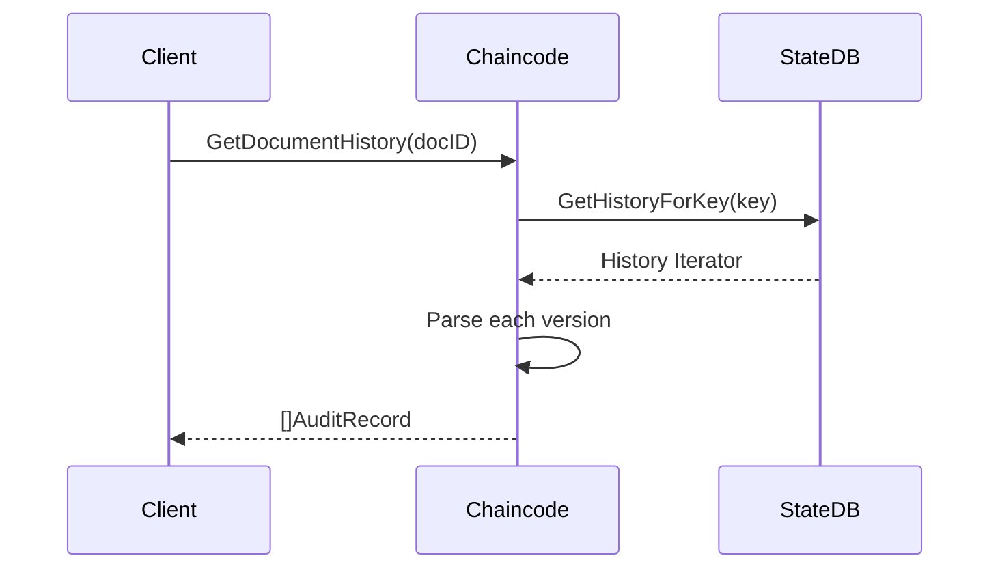

---

# Part 2: AccessContract Functions

## 8. GrantAccess

**Location:** `access_contract.go` (Lines 20-115)  
**Authorization:** ADMIN or Document OWNER only

### 8.1 Sequence Diagram

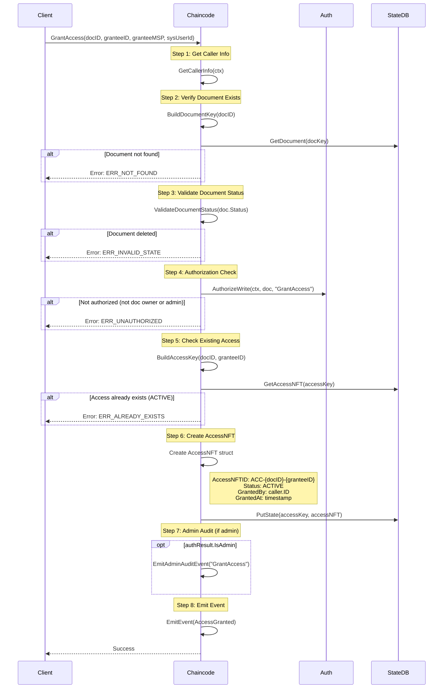

### 8.2 Step-by-Step Flow

| Step | Action | Code Line | Notes |
|------|--------|-----------|-------|
| 1 | Get caller identity | 32-35 | Uses GetCallerInfo |
| 2 | Build document key | 38-41 | DOC~{documentId} |
| 3 | Get document | 43-49 | Must exist |
| 4 | Validate doc status | 52-54 | Must be ACTIVE |
| 5 | **Authorization** | 57-60 | **Checks DOC owner, not access owner** |
| 6 | Build access key | 63-66 | ACC~{docId}~{userId} |
| 7 | Check duplicate | 69-76 | Cannot grant twice |
| 8 | Get timestamp | 79-82 | Deterministic |
| 9 | Create AccessNFT | 85-94 | Set all fields |
| 10 | Save to ledger | 97-99 | PutState |
| 11 | Admin audit | 102-106 | If admin |
| 12 | Emit event | 109-114 | AccessGranted |

### 8.3 AccessNFT Created

```go
accessNFT := AccessNFT{
    AccessNFTID:  "ACC-{docID}-{granteeID}",
    DocumentID:   documentID,
    OwnerID:      granteeUserID,      // Who receives access
    OwnerMSP:     granteeUserMSP,
    SystemUserId: systemUserId,
    Status:       "ACTIVE",
    GrantedBy:    caller.ID,          // Who grants (doc owner or admin)
    GrantedAt:    timestamp,
}
```

---

## 9. RevokeAccess

**Location:** `access_contract.go` (Lines 117-203)  
**Authorization:** ADMIN or Document OWNER only

### 9.1 Sequence Diagram

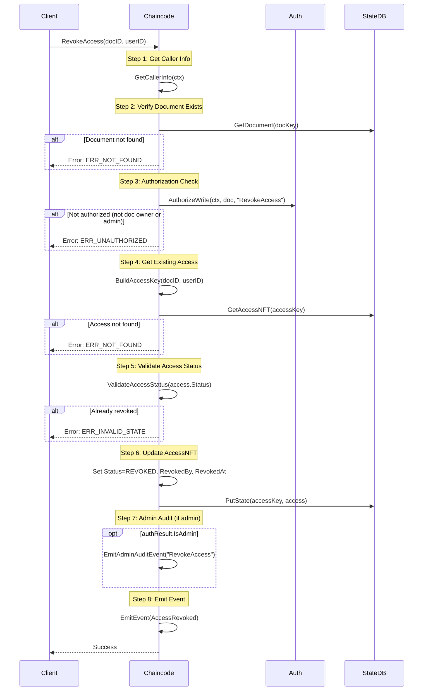

### 9.2 Step-by-Step Flow

| Step | Action | Code Line | Notes |
|------|--------|-----------|-------|
| 1 | Get caller identity | 127-130 | Uses GetCallerInfo |
| 2 | Build document key | 133-136 | DOC~{documentId} |
| 3 | Get document | 138-144 | Must exist |
| 4 | **Authorization** | 147-150 | **Checks DOC owner, not access owner** |
| 5 | Build access key | 153-156 | ACC~{docId}~{userId} |
| 6 | Get access | 159-166 | Must exist |
| 7 | Validate status | 169-171 | Must be ACTIVE |
| 8 | Get timestamp | 174-177 | Deterministic |
| 9 | Update AccessNFT | 180-182 | Set REVOKED, RevokedBy, RevokedAt |
| 10 | Save to ledger | 185-187 | PutState |
| 11 | Admin audit | 190-194 | If admin |
| 12 | Emit event | 197-202 | AccessRevoked |

### 9.3 AccessNFT Updated

```go
// Before revoke
access.Status = "ACTIVE"
access.RevokedBy = ""
access.RevokedAt = ""

// After revoke
access.Status = "REVOKED"
access.RevokedBy = caller.ID      // Who revokes
access.RevokedAt = timestamp      // When revoked
```

---

## 10. GetAccess

**Location:** `access_contract.go` (Lines 209-232)  
**Authorization:** Any user

### 10.1 Sequence Diagram

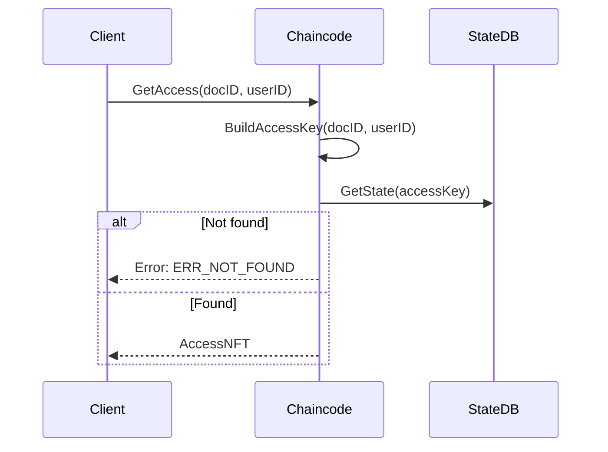

---

## 11. GetAllAccessByDocument

**Location:** `access_contract.go` (Lines 234-268)  
**Authorization:** Any user

### 11.1 Sequence Diagram

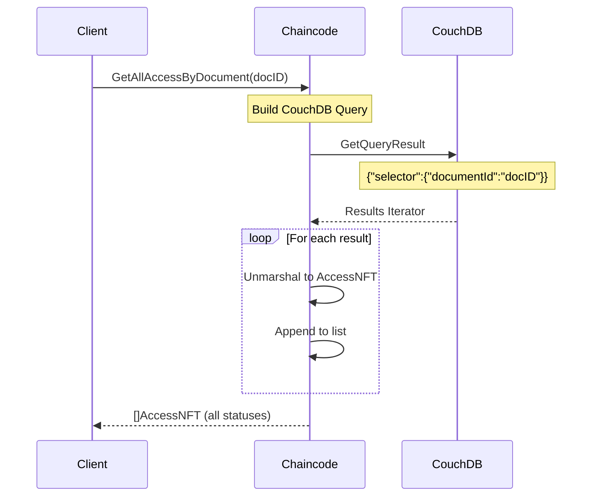

### 11.2 Query Details

```go
queryString := fmt.Sprintf(`{
    "selector": {
        "documentId": "%s"
    }
}`, documentID)
```

**Note:** Returns ALL access records (both ACTIVE and REVOKED).

---

## 12. GetAllAccessByUser

**Location:** `access_contract.go` (Lines 270-305)  
**Authorization:** Any user

### 12.1 Sequence Diagram

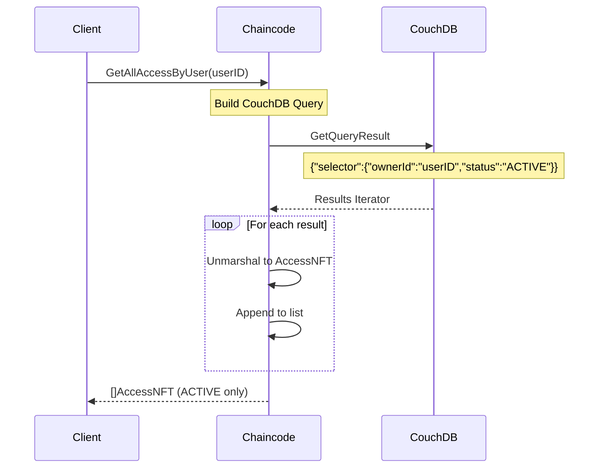

### 12.2 Query Details

```go
queryString := fmt.Sprintf(`{
    "selector": {
        "ownerId": "%s",
        "status": "ACTIVE"
    }
}`, userID)
```

**Note:** Returns only ACTIVE access records (excludes REVOKED).

---

## 13. GetAccessHistory

**Location:** `access_contract.go` (Lines 307-353)  
**Authorization:** Any user

### 13.1 Sequence Diagram

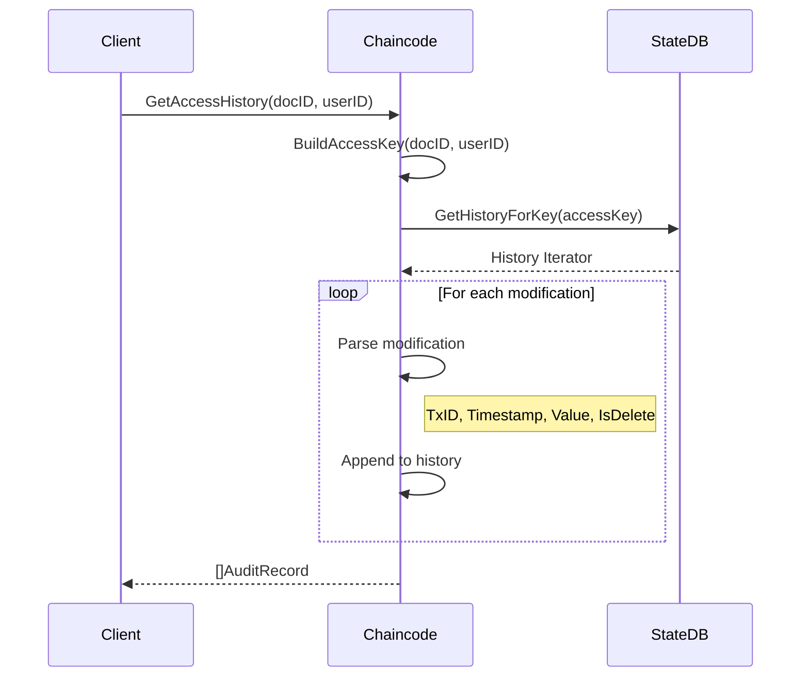

---

# Part 3: Authorization Flow

## 14. AuthorizeWrite Function

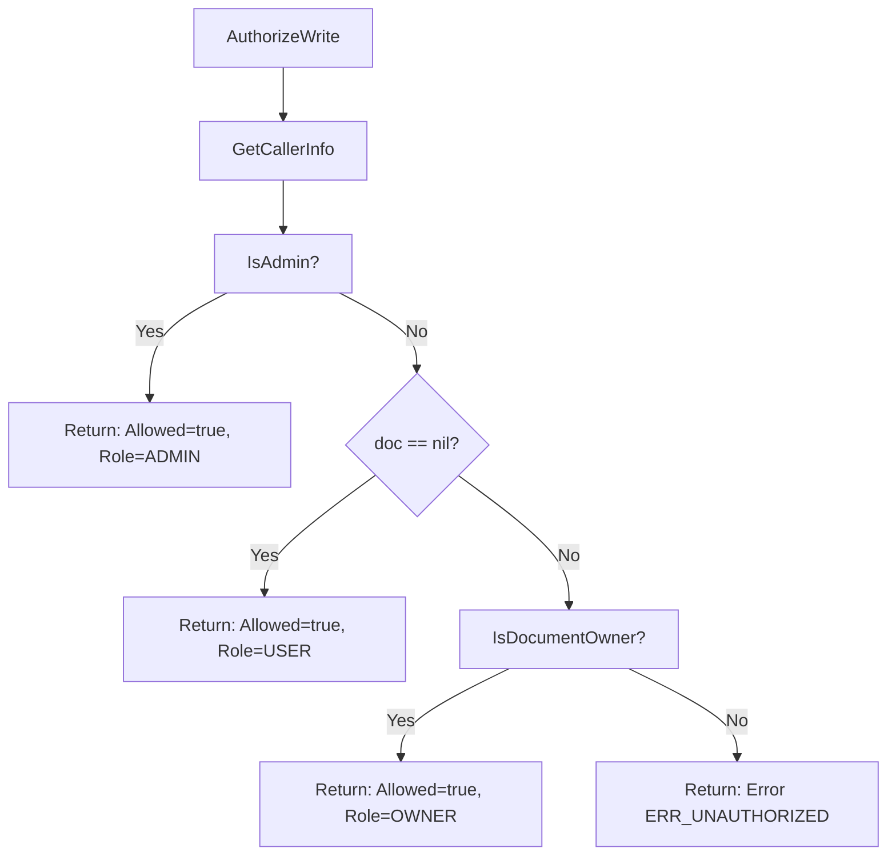

## 15. Key Point: Access Authorization

> **Important:** For GrantAccess and RevokeAccess, the authorization checks the **Document Owner**, not the Access holder. This means:
> - Only the document owner can grant access to their document
> - Only the document owner can revoke access from their document
> - Admin can override both operations

---

# Part 4: Error Summary

| Function | Possible Errors |
|----------|-----------------|
| CreateDocument | `ERR_ALREADY_EXISTS` |
| UpdateDocument | `ERR_NOT_FOUND`, `ERR_UNAUTHORIZED`, `ERR_VERSION_MISMATCH`, `ERR_INVALID_STATE` |
| SoftDeleteDocument | `ERR_NOT_FOUND`, `ERR_UNAUTHORIZED`, `ERR_INVALID_STATE` |
| TransferOwnership | `ERR_NOT_FOUND`, `ERR_UNAUTHORIZED`, `ERR_INVALID_STATE` |
| **GrantAccess** | `ERR_NOT_FOUND` (doc), `ERR_UNAUTHORIZED`, `ERR_INVALID_STATE` (doc), `ERR_ALREADY_EXISTS` |
| **RevokeAccess** | `ERR_NOT_FOUND` (doc or access), `ERR_UNAUTHORIZED`, `ERR_INVALID_STATE` |
| GetAccess | `ERR_NOT_FOUND` |
| GetAllAccessByDocument | None |
| GetAllAccessByUser | None |
| GetAccessHistory | None |

---

## Document History

| Version | Date | Author | Changes |
|---------|------|--------|---------|
| 1.0 | 2026-02-01 | Docube Team | Initial document |
| 2.0 | 2026-02-01 | Docube Team | Added full AccessContract flows |
