# LUỒNG CHỨC NĂNG - Docube Chaincode

**Phiên bản tài liệu:** 3.0
**Cập nhật lần cuối:** 2026-03-10

---

## Mục đích
Tài liệu này cung cấp giải thích luồng từng bước chi tiết cho mỗi chức năng nghiệp vụ trong Docube chaincode, bao gồm cả DocumentContract và AccessContract.

## Phạm vi
- Tất cả thao tác Document (7 hàm)
- Tất cả thao tác Access (6 hàm)
- Luồng authorization
- Xử lý lỗi

## Tài liệu liên quan
- [CODE_ARCHITECTURE_VI.md](CODE_ARCHITECTURE_VI.md)
- [PERMISSION_MATRIX_VI.md](PERMISSION_MATRIX_VI.md)
- [BLOCKCHAIN_SERVICE_VI.md](BLOCKCHAIN_SERVICE_VI.md)

---

# Phần 1: Các hàm DocumentContract

## 1. CreateDocument

**Vị trí:** `document_contract.go` (Dòng 20-85)  
**Authorization:** Bất kỳ user (USER, OWNER, ADMIN)

### 1.1 Sơ đồ Tuần tự

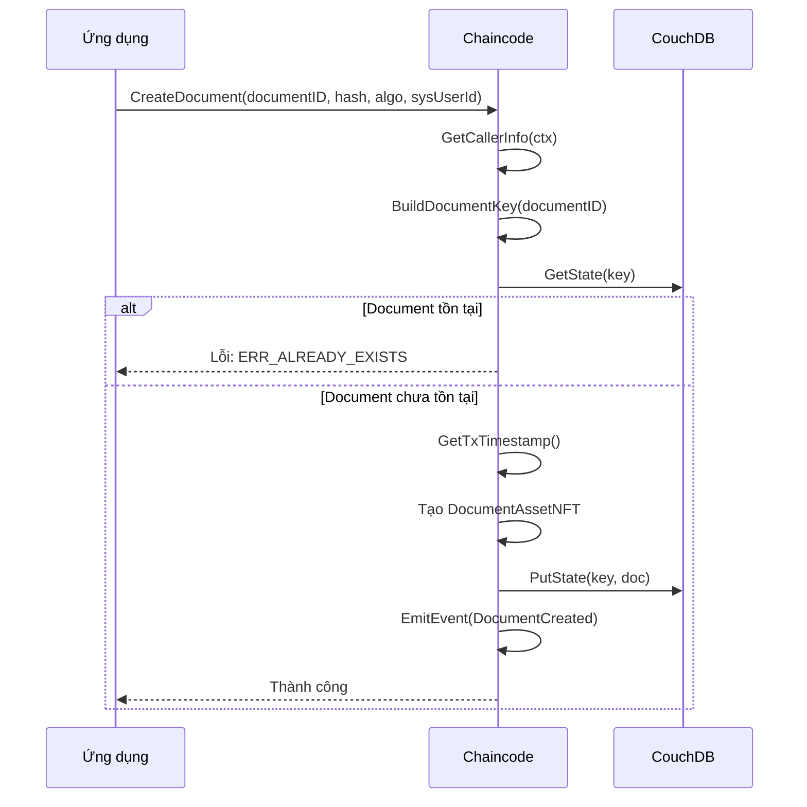
```mermaid
sequenceDiagram
    participant Client as Ứng dụng
    participant Chaincode
    participant StateDB as CouchDB
    
    Client->>Chaincode: CreateDocument(documentID, hash, algo, sysUserId)
    Chaincode->>Chaincode: GetCallerInfo(ctx)
    Chaincode->>Chaincode: BuildDocumentKey(documentID)
    Chaincode->>StateDB: GetState(key)
    
    alt Document tồn tại
        Chaincode-->>Client: Lỗi: ERR_ALREADY_EXISTS
    else Document chưa tồn tại
        Chaincode->>Chaincode: GetTxTimestamp()
        Chaincode->>Chaincode: Tạo DocumentAssetNFT
        Chaincode->>StateDB: PutState(key, doc)
        Chaincode->>Chaincode: EmitEvent(DocumentCreated)
        Chaincode-->>Client: Thành công
    end
```

### 1.2 Luồng Từng Bước

| Bước | Hành động | Tham chiếu Code |
|------|-----------|-----------------|
| 1 | Trích xuất danh tính caller | `GetCallerInfo(ctx)` |
| 2 | Tạo ledger key | `BuildDocumentKey(ctx, documentID)` |
| 3 | Kiểm tra tồn tại | `GetDocument(ctx, key)` |
| 4 | Lấy timestamp | `GetTxTimestamp(ctx)` |
| 5 | Tạo NFT struct | Đặt OwnerID, Version=1, Status=ACTIVE |
| 6 | Lưu vào ledger | `SaveState(ctx, key, doc)` |
| 7 | Phát event | `EmitEvent(ctx, EventDocumentCreated, ...)` |

---

## 2. UpdateDocument

**Vị trí:** `document_contract.go` (Dòng 87-166)  
**Authorization:** Chỉ ADMIN hoặc OWNER

### 2.1 Sơ đồ Tuần tự

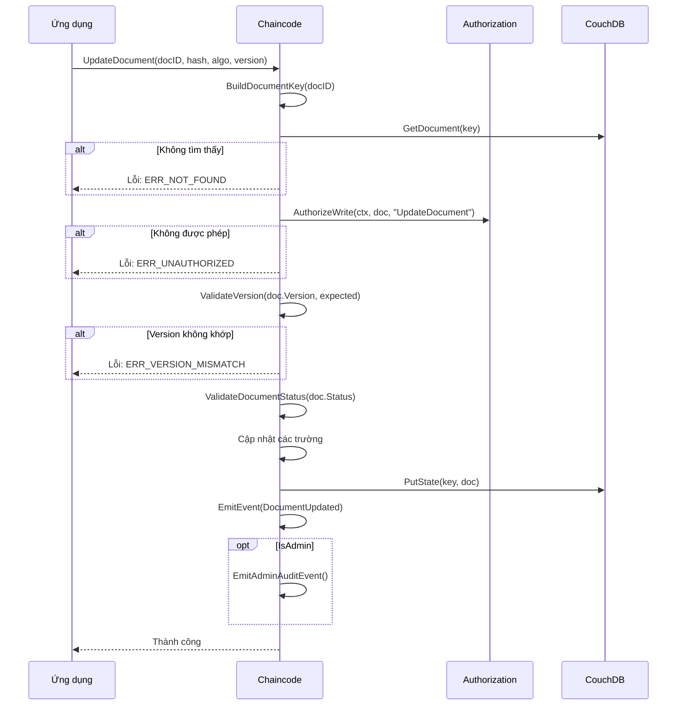
```mermaid
sequenceDiagram
    participant Client as Ứng dụng
    participant Chaincode
    participant Auth as Authorization
    participant StateDB as CouchDB
    
    Client->>Chaincode: UpdateDocument(docID, hash, algo, version)
    Chaincode->>Chaincode: BuildDocumentKey(docID)
    Chaincode->>StateDB: GetDocument(key)
    
    alt Không tìm thấy
        Chaincode-->>Client: Lỗi: ERR_NOT_FOUND
    end
    
    Chaincode->>Auth: AuthorizeWrite(ctx, doc, "UpdateDocument")
    
    alt Không được phép
        Chaincode-->>Client: Lỗi: ERR_UNAUTHORIZED
    end
    
    Chaincode->>Chaincode: ValidateVersion(doc.Version, expected)
    
    alt Version không khớp
        Chaincode-->>Client: Lỗi: ERR_VERSION_MISMATCH
    end
    
    Chaincode->>Chaincode: ValidateDocumentStatus(doc.Status)
    Chaincode->>Chaincode: Cập nhật các trường
    Chaincode->>StateDB: PutState(key, doc)
    Chaincode->>Chaincode: EmitEvent(DocumentUpdated)
    
    opt IsAdmin
        Chaincode->>Chaincode: EmitAdminAuditEvent()
    end
    
    Chaincode-->>Client: Thành công
```

---

## 3. SoftDeleteDocument

**Vị trí:** `document_contract.go` (Dòng 239-308)  
**Authorization:** Chỉ ADMIN hoặc OWNER

### 3.1 Sơ đồ Luồng

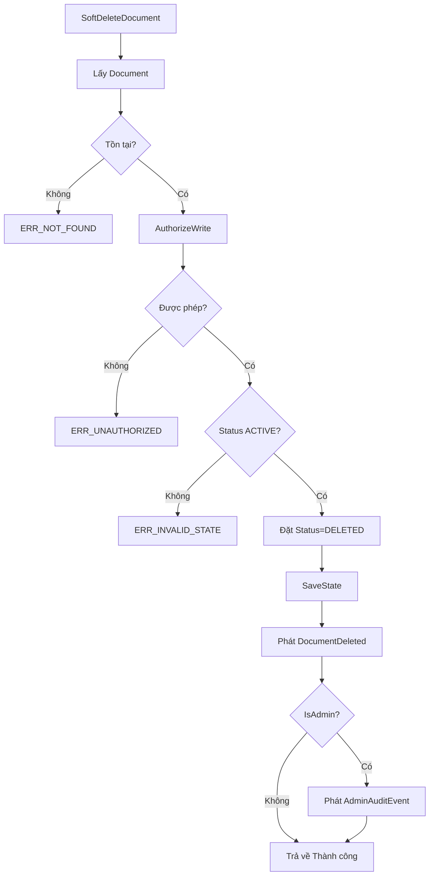
```mermaid
flowchart TD
    A[SoftDeleteDocument] --> B[Lấy Document]
    B --> C{Tồn tại?}
    C -->|Không| D[ERR_NOT_FOUND]
    C -->|Có| E[AuthorizeWrite]
    E --> F{Được phép?}
    F -->|Không| G[ERR_UNAUTHORIZED]
    F -->|Có| H{Status ACTIVE?}
    H -->|Không| I[ERR_INVALID_STATE]
    H -->|Có| J[Đặt Status=DELETED]
    J --> K[SaveState]
    K --> L[Phát DocumentDeleted]
    L --> M{IsAdmin?}
    M -->|Có| N[Phát AdminAuditEvent]
    M -->|Không| O[Trả về Thành công]
    N --> O
```

---

## 4. TransferOwnership

**Vị trí:** `document_contract.go` (Dòng 168-237)  
**Authorization:** Chỉ ADMIN hoặc OWNER

### 4.1 Sơ đồ Tuần tự

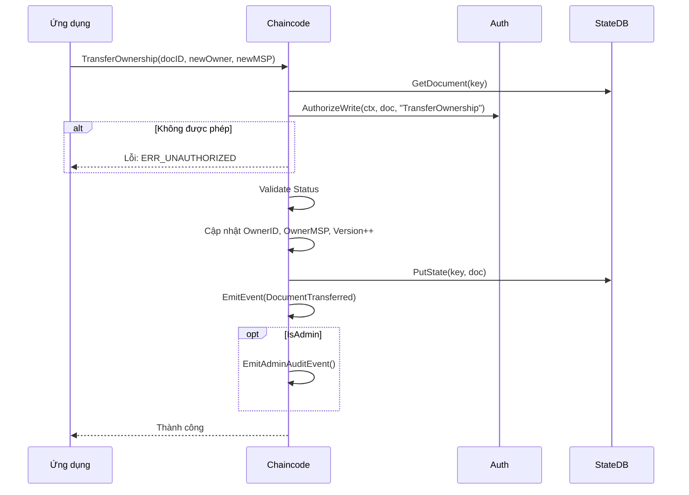
```mermaid
sequenceDiagram
    participant Client as Ứng dụng
    participant Chaincode
    participant Auth
    participant StateDB
    
    Client->>Chaincode: TransferOwnership(docID, newOwner, newMSP)
    Chaincode->>StateDB: GetDocument(key)
    Chaincode->>Auth: AuthorizeWrite(ctx, doc, "TransferOwnership")
    
    alt Không được phép
        Chaincode-->>Client: Lỗi: ERR_UNAUTHORIZED
    end
    
    Chaincode->>Chaincode: Validate Status
    Chaincode->>Chaincode: Cập nhật OwnerID, OwnerMSP, Version++
    Chaincode->>StateDB: PutState(key, doc)
    Chaincode->>Chaincode: EmitEvent(DocumentTransferred)
    
    opt IsAdmin
        Chaincode->>Chaincode: EmitAdminAuditEvent()
    end
    
    Chaincode-->>Client: Thành công
```

---

## 5-7. Các thao tác Query

### 5. GetDocument

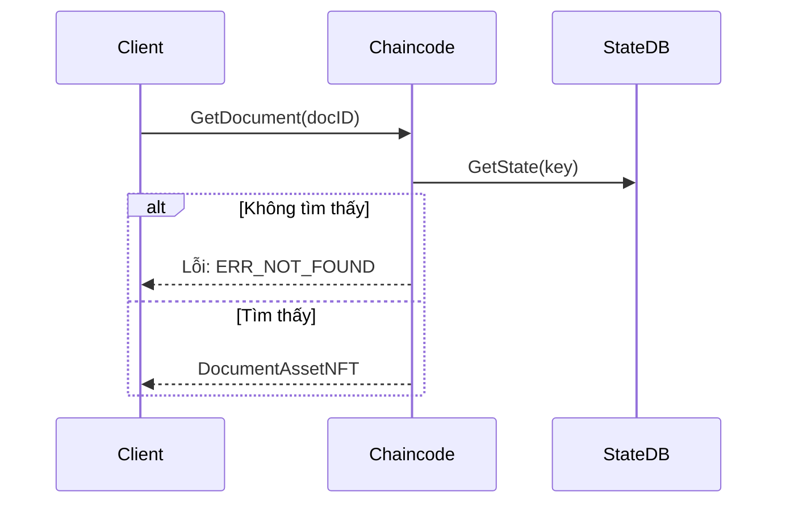
```mermaid
sequenceDiagram
    Client->>Chaincode: GetDocument(docID)
    Chaincode->>StateDB: GetState(key)
    
    alt Không tìm thấy
        Chaincode-->>Client: Lỗi: ERR_NOT_FOUND
    else Tìm thấy
        Chaincode-->>Client: DocumentAssetNFT
    end
```

### 6. GetAllDocuments

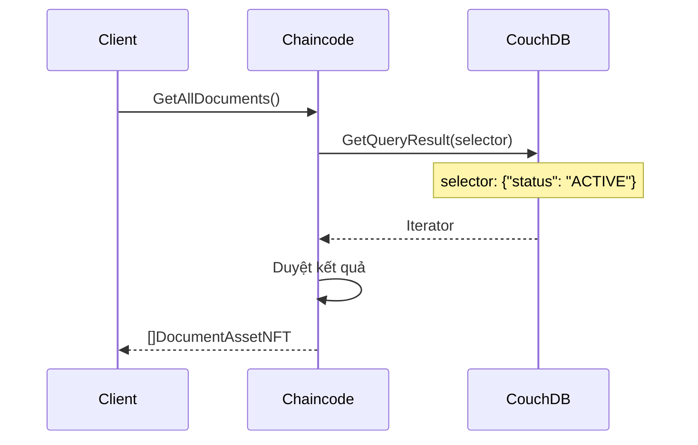
```mermaid
sequenceDiagram
    Client->>Chaincode: GetAllDocuments()
    Chaincode->>CouchDB: GetQueryResult(selector)
    Note over CouchDB: selector: {"status": "ACTIVE"}
    CouchDB-->>Chaincode: Iterator
    Chaincode->>Chaincode: Duyệt kết quả
    Chaincode-->>Client: []DocumentAssetNFT
```

### 7. GetDocumentHistory

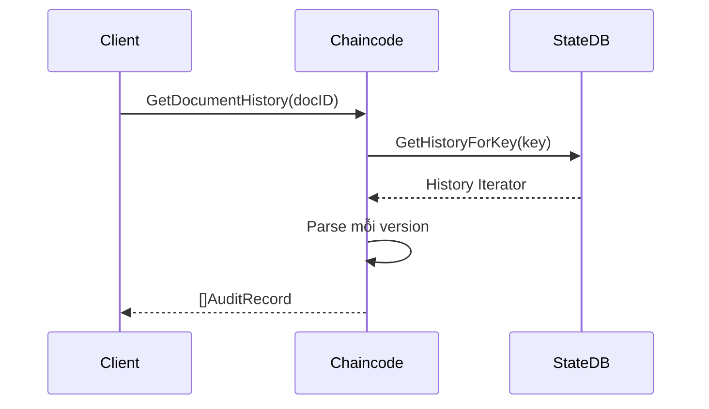
```mermaid
sequenceDiagram
    Client->>Chaincode: GetDocumentHistory(docID)
    Chaincode->>StateDB: GetHistoryForKey(key)
    StateDB-->>Chaincode: History Iterator
    Chaincode->>Chaincode: Parse mỗi version
    Chaincode-->>Client: []AuditRecord
```

---

# Phần 2: Các hàm AccessContract

## 8. GrantAccess

**Vị trí:** `access_contract.go` (Dòng 20-115)  
**Authorization:** Chỉ ADMIN hoặc OWNER của Document

### 8.1 Sơ đồ Tuần tự

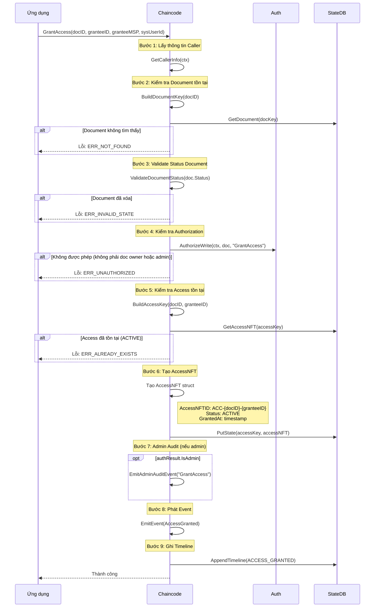
```mermaid
sequenceDiagram
    participant Client as Ứng dụng
    participant Chaincode
    participant Auth
    participant StateDB
    
    Client->>Chaincode: GrantAccess(docID, granteeID, granteeMSP, sysUserId)
    
    Note over Chaincode: Bước 1: Lấy thông tin Caller
    Chaincode->>Chaincode: GetCallerInfo(ctx)
    
    Note over Chaincode: Bước 2: Kiểm tra Document tồn tại
    Chaincode->>Chaincode: BuildDocumentKey(docID)
    Chaincode->>StateDB: GetDocument(docKey)
    
    alt Document không tìm thấy
        Chaincode-->>Client: Lỗi: ERR_NOT_FOUND
    end
    
    Note over Chaincode: Bước 3: Validate Status Document
    Chaincode->>Chaincode: ValidateDocumentStatus(doc.Status)
    
    alt Document đã xóa
        Chaincode-->>Client: Lỗi: ERR_INVALID_STATE
    end
    
    Note over Chaincode: Bước 4: Kiểm tra Authorization
    Chaincode->>Auth: AuthorizeWrite(ctx, doc, "GrantAccess")
    
    alt Không được phép (không phải doc owner hoặc admin)
        Chaincode-->>Client: Lỗi: ERR_UNAUTHORIZED
    end
    
    Note over Chaincode: Bước 5: Kiểm tra Access tồn tại
    Chaincode->>Chaincode: BuildAccessKey(docID, granteeID)
    Chaincode->>StateDB: GetAccessNFT(accessKey)
    
    alt Access đã tồn tại (ACTIVE)
        Chaincode-->>Client: Lỗi: ERR_ALREADY_EXISTS
    end
    
    Note over Chaincode: Bước 6: Tạo AccessNFT
    Chaincode->>Chaincode: Tạo AccessNFT struct
    Note right of Chaincode: AccessNFTID: ACC-{docID}-{granteeID}<br/>Status: ACTIVE<br/>GrantedAt: timestamp

    Chaincode->>StateDB: PutState(accessKey, accessNFT)

    Note over Chaincode: Bước 7: Admin Audit (nếu admin)
    opt authResult.IsAdmin
        Chaincode->>Chaincode: EmitAdminAuditEvent("GrantAccess")
    end

    Note over Chaincode: Bước 8: Phát Event
    Chaincode->>Chaincode: EmitEvent(AccessGranted)

    Note over Chaincode: Bước 9: Ghi Timeline
    Chaincode->>StateDB: AppendTimeline(ACCESS_GRANTED)
    Chaincode-->>Client: Thành công
```

### 8.2 Luồng Từng Bước

| Bước | Hành động | Dòng Code | Ghi chú |
|------|-----------|-----------|---------|
| 1 | Lấy danh tính caller | 32-35 | Sử dụng GetCallerInfo |
| 2 | Tạo document key | 38-41 | DOC~{documentId} |
| 3 | Lấy document | 43-49 | Phải tồn tại |
| 4 | Validate doc status | 52-54 | Phải là ACTIVE |
| 5 | **Authorization** | 57-60 | **Kiểm tra DOC owner, không phải access owner** |
| 6 | Tạo access key | 63-66 | ACC~{docId}~{userId} |
| 7 | Kiểm tra trùng lặp | 69-76 | Không thể grant 2 lần |
| 8 | Lấy timestamp | 79-82 | Xác định |
| 9 | Tạo AccessNFT | 85-93 | Đặt các trường (không có GrantedBy) |
| 10 | Lưu vào ledger | 96-98 | PutState |
| 11 | Admin audit | 101-105 | Nếu admin |
| 12 | Phát event | 108-115 | AccessGranted |
| 13 | Ghi timeline | 118-123 | AppendTimeline(ACCESS_GRANTED) |

### 8.3 AccessNFT Được Tạo

```go
accessNFT := AccessNFT{
    AccessNFTID:  "ACC-{docID}-{granteeID}",
    DocumentID:   documentID,
    OwnerID:      granteeUserID,      // Fabric identity người nhận quyền
    OwnerMSP:     granteeUserMSP,
    SystemUserId: systemUserId,        // App-layer ID người nhận quyền
    Status:       "ACTIVE",
    GrantedAt:    timestamp,
}
// Thông tin granter được ghi trong Timeline record (ActorID, ActorMSP)
```

---

## 9. RevokeAccess

**Vị trí:** `access_contract.go` (Dòng 117-203)  
**Authorization:** Chỉ ADMIN hoặc OWNER của Document

### 9.1 Sơ đồ Tuần tự

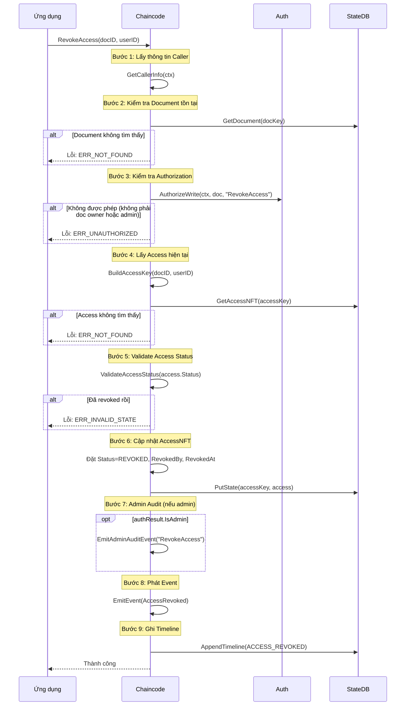
```mermaid
sequenceDiagram
    participant Client as Ứng dụng
    participant Chaincode
    participant Auth
    participant StateDB
    
    Client->>Chaincode: RevokeAccess(docID, userID)
    
    Note over Chaincode: Bước 1: Lấy thông tin Caller
    Chaincode->>Chaincode: GetCallerInfo(ctx)
    
    Note over Chaincode: Bước 2: Kiểm tra Document tồn tại
    Chaincode->>StateDB: GetDocument(docKey)
    
    alt Document không tìm thấy
        Chaincode-->>Client: Lỗi: ERR_NOT_FOUND
    end
    
    Note over Chaincode: Bước 3: Kiểm tra Authorization
    Chaincode->>Auth: AuthorizeWrite(ctx, doc, "RevokeAccess")
    
    alt Không được phép (không phải doc owner hoặc admin)
        Chaincode-->>Client: Lỗi: ERR_UNAUTHORIZED
    end
    
    Note over Chaincode: Bước 4: Lấy Access hiện tại
    Chaincode->>Chaincode: BuildAccessKey(docID, userID)
    Chaincode->>StateDB: GetAccessNFT(accessKey)
    
    alt Access không tìm thấy
        Chaincode-->>Client: Lỗi: ERR_NOT_FOUND
    end
    
    Note over Chaincode: Bước 5: Validate Access Status
    Chaincode->>Chaincode: ValidateAccessStatus(access.Status)
    
    alt Đã revoked rồi
        Chaincode-->>Client: Lỗi: ERR_INVALID_STATE
    end
    
    Note over Chaincode: Bước 6: Cập nhật AccessNFT
    Chaincode->>Chaincode: Đặt Status=REVOKED, RevokedBy, RevokedAt
    Chaincode->>StateDB: PutState(accessKey, access)
    
    Note over Chaincode: Bước 7: Admin Audit (nếu admin)
    opt authResult.IsAdmin
        Chaincode->>Chaincode: EmitAdminAuditEvent("RevokeAccess")
    end
    
    Note over Chaincode: Bước 8: Phát Event
    Chaincode->>Chaincode: EmitEvent(AccessRevoked)

    Note over Chaincode: Bước 9: Ghi Timeline
    Chaincode->>StateDB: AppendTimeline(ACCESS_REVOKED)
    Chaincode-->>Client: Thành công
```

### 9.2 Luồng Từng Bước

| Bước | Hành động | Dòng Code | Ghi chú |
|------|-----------|-----------|---------|
| 1 | Lấy danh tính caller | 127-130 | Sử dụng GetCallerInfo |
| 2 | Tạo document key | 133-136 | DOC~{documentId} |
| 3 | Lấy document | 138-144 | Phải tồn tại |
| 4 | **Authorization** | 147-150 | **Kiểm tra DOC owner, không phải access owner** |
| 5 | Tạo access key | 153-156 | ACC~{docId}~{userId} |
| 6 | Lấy access | 159-166 | Phải tồn tại |
| 7 | Validate status | 169-171 | Phải là ACTIVE |
| 8 | Lấy timestamp | 174-177 | Xác định |
| 9 | Cập nhật AccessNFT | 180-182 | Đặt REVOKED, RevokedBy, RevokedAt |
| 10 | Lưu vào ledger | 185-187 | PutState |
| 11 | Admin audit | 190-194 | Nếu admin |
| 12 | Phát event | 197-202 | AccessRevoked |
| 13 | Ghi timeline | 215-218 | AppendTimeline(ACCESS_REVOKED) |

### 9.3 AccessNFT Được Cập nhật

```go
// Trước khi revoke
access.Status = "ACTIVE"
access.RevokedBy = ""
access.RevokedAt = ""

// Sau khi revoke
access.Status = "REVOKED"
access.RevokedBy = caller.ID      // Ai thu hồi
access.RevokedAt = timestamp      // Khi nào thu hồi
```

---

## 10. GetAccess

**Vị trí:** `access_contract.go` (Dòng 209-232)  
**Authorization:** Bất kỳ user

### 10.1 Sơ đồ Tuần tự

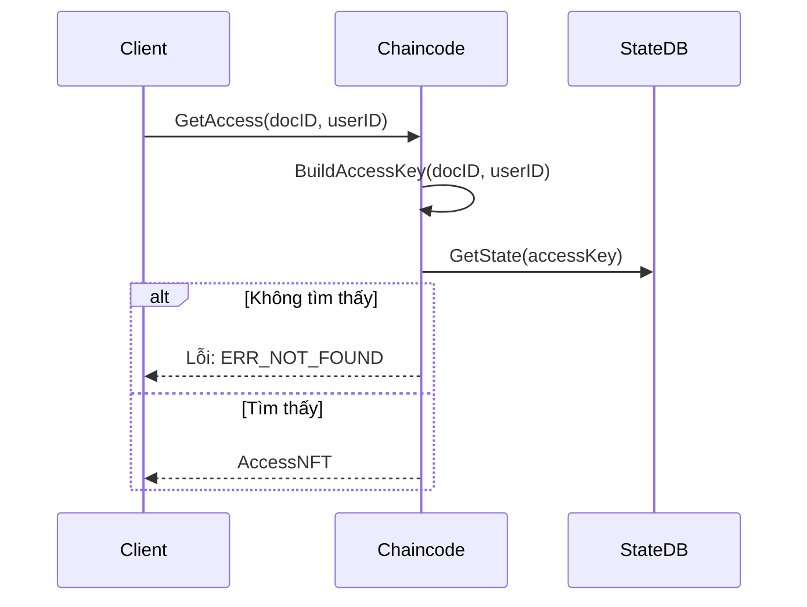
```mermaid
sequenceDiagram
    participant Client
    participant Chaincode
    participant StateDB
    
    Client->>Chaincode: GetAccess(docID, userID)
    Chaincode->>Chaincode: BuildAccessKey(docID, userID)
    Chaincode->>StateDB: GetState(accessKey)
    
    alt Không tìm thấy
        Chaincode-->>Client: Lỗi: ERR_NOT_FOUND
    else Tìm thấy
        Chaincode-->>Client: AccessNFT
    end
```

---

## 11. GetAllAccessByDocument

**Vị trí:** `access_contract.go` (Dòng 234-268)  
**Authorization:** Bất kỳ user

### 11.1 Sơ đồ Tuần tự

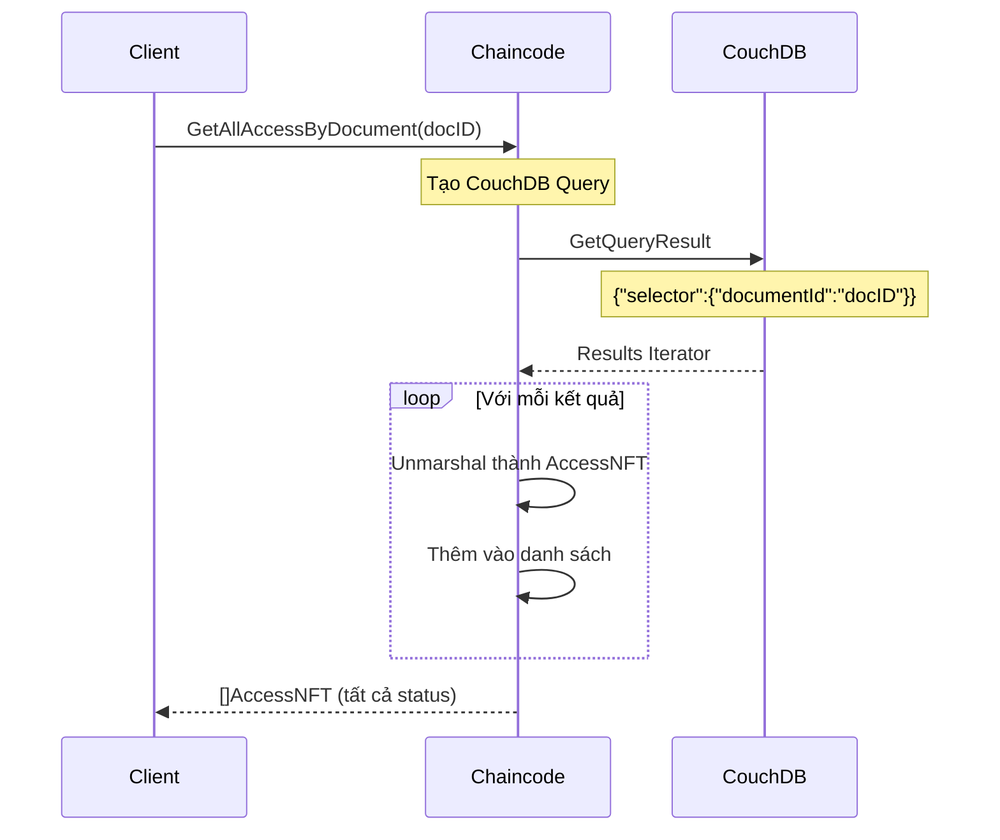
```mermaid
sequenceDiagram
    participant Client
    participant Chaincode
    participant CouchDB
    
    Client->>Chaincode: GetAllAccessByDocument(docID)
    
    Note over Chaincode: Tạo CouchDB Query
    Chaincode->>CouchDB: GetQueryResult
    Note over CouchDB: {"selector":{"documentId":"docID"}}
    
    CouchDB-->>Chaincode: Results Iterator
    
    loop Với mỗi kết quả
        Chaincode->>Chaincode: Unmarshal thành AccessNFT
        Chaincode->>Chaincode: Thêm vào danh sách
    end
    
    Chaincode-->>Client: []AccessNFT (tất cả status)
```

### 11.2 Chi tiết Query

```go
queryString := fmt.Sprintf(`{
    "selector": {
        "documentId": "%s"
    }
}`, documentID)
```

**Lưu ý:** Trả về TẤT CẢ access records (cả ACTIVE và REVOKED).

---

## 12. GetAllAccessByUser

**Vị trí:** `access_contract.go` (Dòng 270-305)  
**Authorization:** Bất kỳ user

### 12.1 Sơ đồ Tuần tự

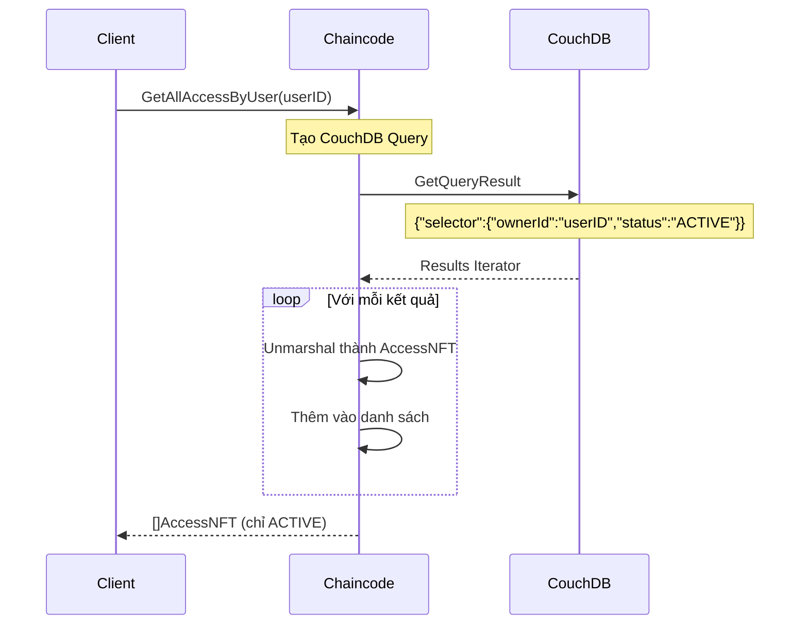
```mermaid
sequenceDiagram
    participant Client
    participant Chaincode
    participant CouchDB
    
    Client->>Chaincode: GetAllAccessByUser(userID)
    
    Note over Chaincode: Tạo CouchDB Query
    Chaincode->>CouchDB: GetQueryResult
    Note over CouchDB: {"selector":{"ownerId":"userID","status":"ACTIVE"}}
    
    CouchDB-->>Chaincode: Results Iterator
    
    loop Với mỗi kết quả
        Chaincode->>Chaincode: Unmarshal thành AccessNFT
        Chaincode->>Chaincode: Thêm vào danh sách
    end
    
    Chaincode-->>Client: []AccessNFT (chỉ ACTIVE)
```

### 12.2 Chi tiết Query

```go
queryString := fmt.Sprintf(`{
    "selector": {
        "ownerId": "%s",
        "status": "ACTIVE"
    }
}`, userID)
```

**Lưu ý:** Chỉ trả về access records ACTIVE (loại trừ REVOKED).

---

## 13. GetAccessHistory

**Vị trí:** `access_contract.go` (Dòng 307-353)  
**Authorization:** Bất kỳ user

### 13.1 Sơ đồ Tuần tự

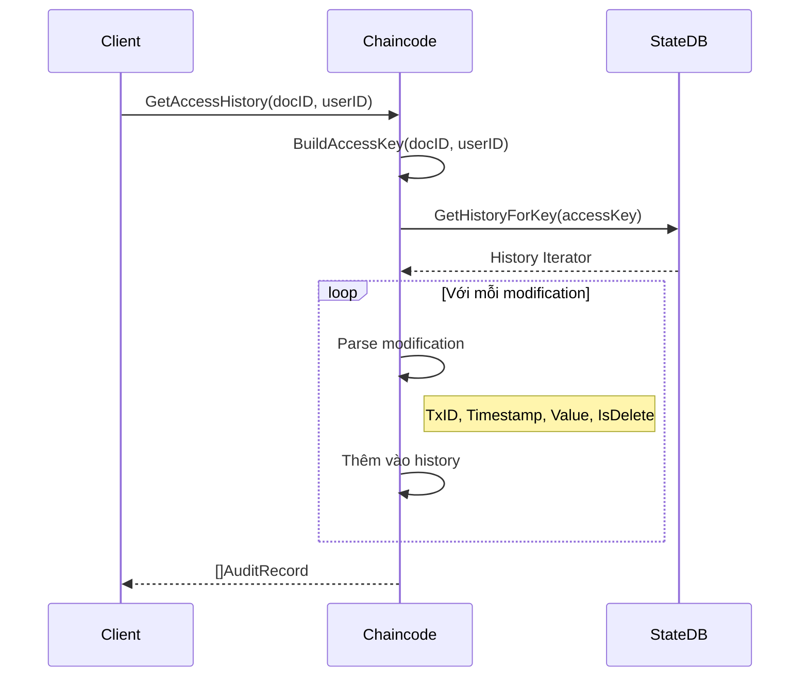
```mermaid
sequenceDiagram
    participant Client
    participant Chaincode
    participant StateDB
    
    Client->>Chaincode: GetAccessHistory(docID, userID)
    Chaincode->>Chaincode: BuildAccessKey(docID, userID)
    Chaincode->>StateDB: GetHistoryForKey(accessKey)
    StateDB-->>Chaincode: History Iterator
    
    loop Với mỗi modification
        Chaincode->>Chaincode: Parse modification
        Note right of Chaincode: TxID, Timestamp, Value, IsDelete
        Chaincode->>Chaincode: Thêm vào history
    end
    
    Chaincode-->>Client: []AuditRecord
```

---

## 14. CheckAccessPermission (Read-Only)

**Vị trí:** `access_contract.go`
**Authorization:** Bất kỳ user (evaluate, không ghi state)

### 14.1 Sơ đồ Tuần tự

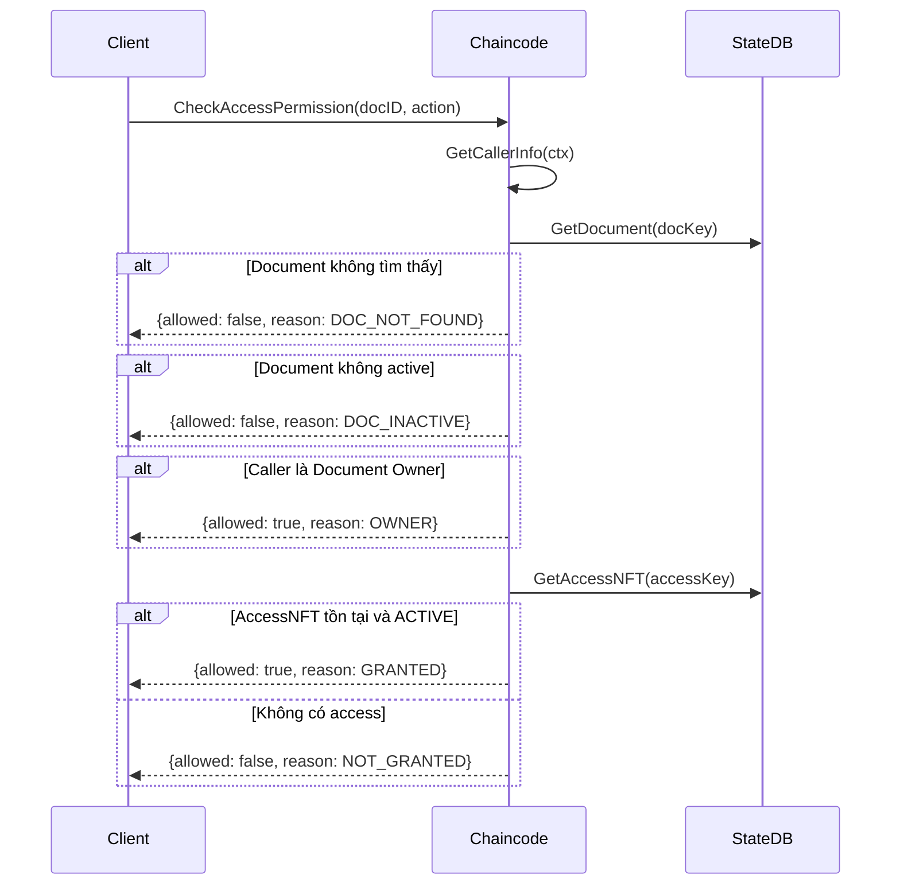
```mermaid
sequenceDiagram
    participant Client
    participant Chaincode
    participant StateDB

    Client->>Chaincode: CheckAccessPermission(docID, action)
    Chaincode->>Chaincode: GetCallerInfo(ctx)
    Chaincode->>StateDB: GetDocument(docKey)

    alt Document không tìm thấy
        Chaincode-->>Client: {allowed: false, reason: DOC_NOT_FOUND}
    end

    alt Document không active
        Chaincode-->>Client: {allowed: false, reason: DOC_INACTIVE}
    end

    alt Caller là Document Owner
        Chaincode-->>Client: {allowed: true, reason: OWNER}
    end

    Chaincode->>StateDB: GetAccessNFT(accessKey)

    alt AccessNFT tồn tại và ACTIVE
        Chaincode-->>Client: {allowed: true, reason: GRANTED}
    else Không có access
        Chaincode-->>Client: {allowed: false, reason: NOT_GRANTED}
    end
```

### 14.2 Kết quả trả về

```go
type AccessCheckResult struct {
    Allowed    bool   `json:"allowed"`    // Có quyền hay không
    Reason     string `json:"reason"`     // OWNER | GRANTED | NOT_GRANTED | DOC_NOT_FOUND | DOC_INACTIVE
    DocumentID string `json:"documentId"`
    CallerID   string `json:"callerId"`
    Action     string `json:"action"`     // READ, WRITE, etc.
}
```

---

## 15. GetDocumentTimeline

**Vị trí:** `access_contract.go`
**Authorization:** Bất kỳ user

### 15.1 Sơ đồ Tuần tự

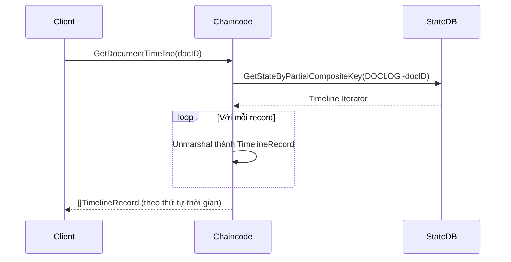
```mermaid
sequenceDiagram
    participant Client
    participant Chaincode
    participant StateDB

    Client->>Chaincode: GetDocumentTimeline(docID)
    Chaincode->>StateDB: GetStateByPartialCompositeKey(DOCLOG~docID)
    StateDB-->>Chaincode: Timeline Iterator

    loop Với mỗi record
        Chaincode->>Chaincode: Unmarshal thành TimelineRecord
    end

    Chaincode-->>Client: []TimelineRecord (theo thứ tự thời gian)
```

---

# Phần 3: Luồng Authorization

## 14. Hàm AuthorizeWrite

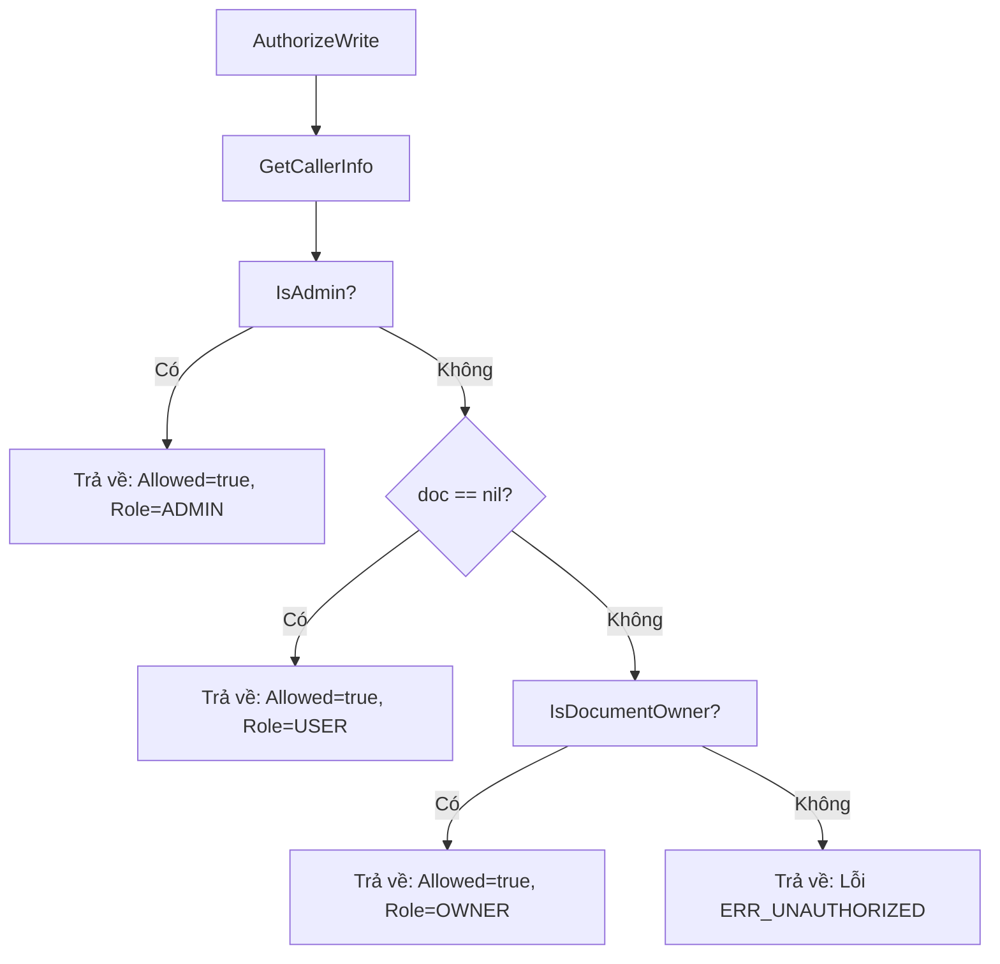
```mermaid
flowchart TD
    A[AuthorizeWrite] --> B[GetCallerInfo]
    B --> C[IsAdmin?]
    C -->|Có| D[Trả về: Allowed=true, Role=ADMIN]
    C -->|Không| E{doc == nil?}
    E -->|Có| F[Trả về: Allowed=true, Role=USER]
    E -->|Không| G[IsDocumentOwner?]
    G -->|Có| H[Trả về: Allowed=true, Role=OWNER]
    G -->|Không| I[Trả về: Lỗi ERR_UNAUTHORIZED]
```

## 15. Điểm Quan trọng: Authorization cho Access

> **Quan trọng:** Với GrantAccess và RevokeAccess, authorization kiểm tra **Document Owner**, không phải Access holder. Nghĩa là:
> - Chỉ document owner có thể cấp quyền cho document của họ
> - Chỉ document owner có thể thu hồi quyền từ document của họ
> - Admin có thể override cả hai thao tác

---

# Phần 4: Tóm tắt Lỗi

| Hàm | Lỗi có thể xảy ra |
|-----|-------------------|
| CreateDocument | `ERR_ALREADY_EXISTS` |
| UpdateDocument | `ERR_NOT_FOUND`, `ERR_UNAUTHORIZED`, `ERR_VERSION_MISMATCH`, `ERR_INVALID_STATE` |
| SoftDeleteDocument | `ERR_NOT_FOUND`, `ERR_UNAUTHORIZED`, `ERR_INVALID_STATE` |
| TransferOwnership | `ERR_NOT_FOUND`, `ERR_UNAUTHORIZED`, `ERR_INVALID_STATE` |
| **GrantAccess** | `ERR_NOT_FOUND` (doc), `ERR_UNAUTHORIZED`, `ERR_INVALID_STATE` (doc), `ERR_ALREADY_EXISTS` |
| **RevokeAccess** | `ERR_NOT_FOUND` (doc hoặc access), `ERR_UNAUTHORIZED`, `ERR_INVALID_STATE` |
| GetAccess | `ERR_NOT_FOUND` |
| GetAllAccessByDocument | Không có |
| GetAllAccessByUser | Không có |
| GetAccessHistory | Không có |

---

## Lịch sử Tài liệu

| Phiên bản | Ngày | Tác giả | Thay đổi |
|-----------|------|---------|----------|
| 1.0 | 2026-02-01 | Đội Docube | Tài liệu ban đầu |
| 2.0 | 2026-02-01 | Đội Docube | Thêm đầy đủ luồng AccessContract |
| 3.0 | 2026-03-10 | Đội Docube | Loại bỏ GrantedBy, thêm Timeline, thêm CheckAccessPermission/GetDocumentTimeline |
