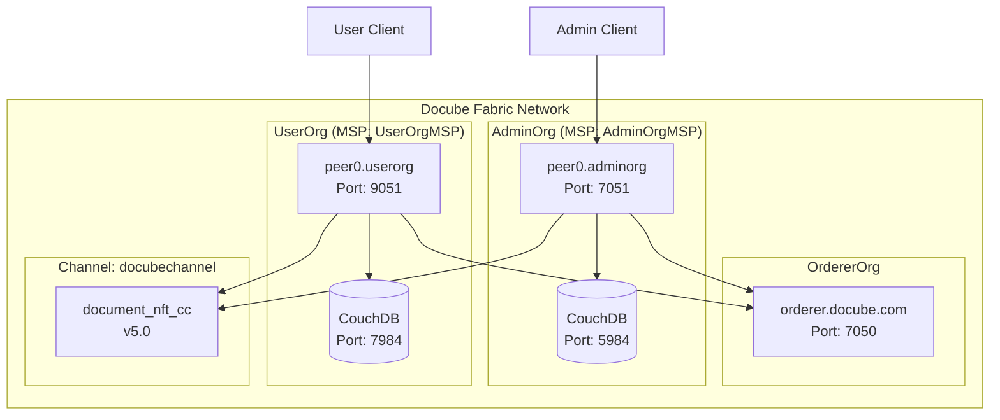
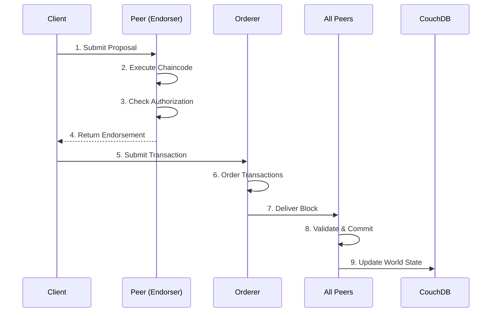
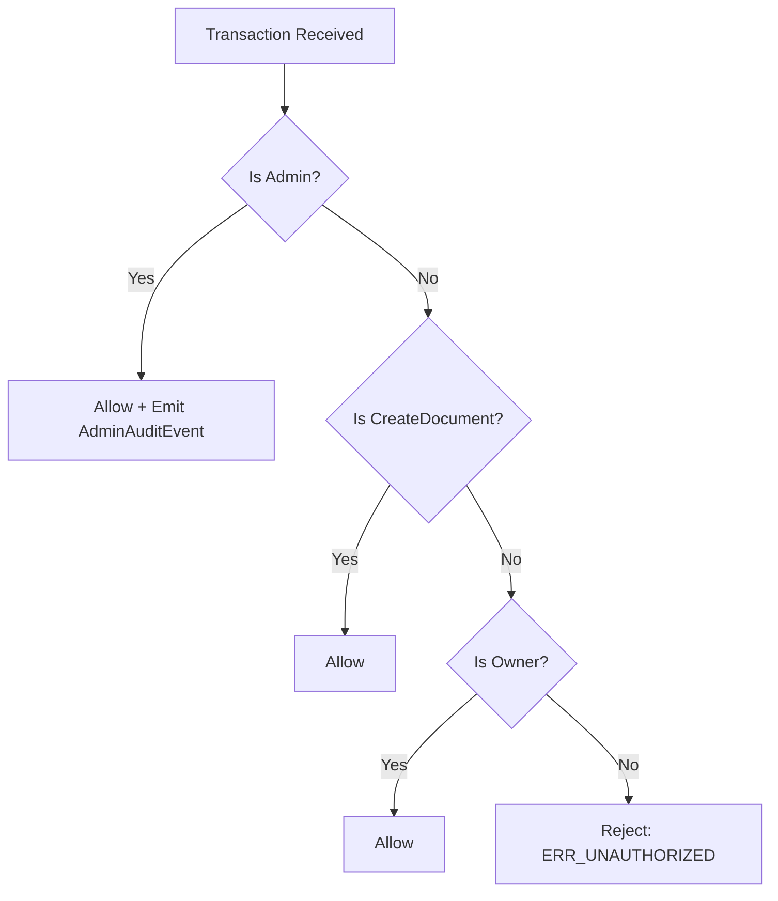

# NETWORK ARCHITECTURE - Docube Fabric Network

**Document Version:** 1.0  
**Last Updated:** 2026-02-01  
**Author:** Docube Engineering Team

---

## Purpose
This document describes the complete Hyperledger Fabric network architecture for the Docube Document Management System.

## Scope
- Network topology
- Organization structure
- Channel configuration
- Certificate Authority setup
- Transaction flow

## Audience
- DevOps Engineers
- Blockchain Developers
- System Administrators
- Auditors

## Assumptions
- Fabric v2.5+ is installed
- Docker and Docker Compose are available
- Basic understanding of Hyperledger Fabric concepts

## References
- [NETWORK_CONFIG_FILES_EN.md](NETWORK_CONFIG_FILES_EN.md)
- [PERMISSION_MATRIX_EN.md](PERMISSION_MATRIX_EN.md)

---

## 1. Network Overview

The Docube network is a permissioned blockchain network built on Hyperledger Fabric, designed for enterprise document management with NFT-based ownership tracking.

### 1.1 Key Components

| Component | Description |
|-----------|-------------|
| **2 Peer Organizations** | AdminOrg (Admin), UserOrg (User) |
| **1 Orderer Organization** | OrdererOrg (Raft consensus) |
| **1 Channel** | docubechannel |
| **1 Chaincode** | document_nft_cc v5.0 |
| **State Database** | CouchDB (rich queries) |

---

## 2. Architecture Diagram



---

## 3. Organizations

### 3.1 OrdererOrg

| Attribute | Value |
|-----------|-------|
| **Name** | OrdererOrg |
| **MSP ID** | OrdererMSP |
| **Role** | Transaction ordering (Raft consensus) |
| **Orderer** | orderer.docube.com:7050 |
| **Admin Port** | 7053 |

### 3.2 AdminOrg

| Attribute | Value |
|-----------|-------|
| **Name** | AdminOrgMSP |
| **MSP ID** | AdminOrgMSP |
| **Role** | System administrator, full permissions |
| **Peer** | peer0.adminorg.docube.com:7051 |
| **CouchDB** | localhost:5984 |

**Permissions:**
- ✅ Create, Update, Delete documents
- ✅ Grant/Revoke access
- ✅ Override any document (Admin privilege)
- ✅ Deploy/upgrade chaincode
- ✅ Channel administration

### 3.3 UserOrg

| Attribute | Value |
|-----------|-------|
| **Name** | UserOrgMSP |
| **MSP ID** | UserOrgMSP |
| **Role** | Regular user organization |
| **Peer** | peer0.userorg.docube.com:9051 |
| **CouchDB** | localhost:7984 |

**Permissions:**
- ✅ Create documents (becomes OWNER)
- ✅ Update/Delete OWN documents only
- ✅ Query all documents
- ❌ Cannot modify others' documents
- ❌ Cannot override (not Admin)

---

## 4. Channel Configuration

### 4.1 Channel: docubechannel

| Setting | Value |
|---------|-------|
| **Name** | docubechannel |
| **Members** | AdminOrg, UserOrg |
| **Orderer** | OrdererOrg (Raft) |
| **Block Size** | Max 10 messages / 99MB |
| **Block Timeout** | 2 seconds |

### 4.2 Channel Policies

```yaml
Channel Policies:
  Readers:   ANY - Both orgs can read
  Writers:   ANY - Both orgs can submit transactions
  Admins:    AdminOrgMSP.admin - Only AdminOrg can modify channel

Application Policies:
  Endorsement: OR('AdminOrgMSP.peer') - AdminOrg endorses writes
  LifecycleEndorsement: OR('AdminOrgMSP.peer') - AdminOrg deploys chaincode
```

---

## 5. Certificate Authority

The network uses **cryptogen** tool to generate certificates:

```
organizations/
├── ordererOrganizations/
│   └── docube.com/
│       ├── ca/                 # Orderer CA
│       ├── msp/                # Orderer MSP
│       └── orderers/           # Orderer node certs
├── peerOrganizations/
│   ├── adminorg.docube.com/
│   │   ├── ca/                 # AdminOrg CA
│   │   ├── msp/                # AdminOrg MSP
│   │   ├── peers/              # Peer certs
│   │   └── users/              # User certs
│   └── userorg.docube.com/
│       ├── ca/                 # UserOrg CA
│       ├── msp/                # UserOrg MSP
│       ├── peers/              # Peer certs
│       └── users/              # User certs
```

---

## 6. Transaction Flow

### 6.1 Transaction Flow Diagram



### 6.2 Authorization Flow (Chaincode Level)



---

## 7. Network Endpoints

| Service | Host | Port | Protocol |
|---------|------|------|----------|
| Orderer | orderer.docube.com | 7050 | gRPC/TLS |
| Orderer Admin | orderer.docube.com | 7053 | gRPC/TLS |
| AdminOrg Peer | peer0.adminorg.docube.com | 7051 | gRPC/TLS |
| UserOrg Peer | peer0.userorg.docube.com | 9051 | gRPC/TLS |
| AdminOrg CouchDB | localhost | 5984 | HTTP |
| UserOrg CouchDB | localhost | 7984 | HTTP |

---

## 8. Security Features

### 8.1 TLS Configuration
- All communication is TLS-encrypted
- Mutual TLS for orderer cluster
- Certificate-based authentication

### 8.2 MSP (Membership Service Provider)
- X.509 certificates for identity
- Role-based access (admin, peer, client)
- Organization-based isolation

### 8.3 Chaincode-Level Security
- Role-based authorization: USER / OWNER / ADMIN
- Admin actions are audited (AdminAction events)
- Optimistic locking prevents race conditions

---

## 9. State Database (CouchDB)

| Feature | Description |
|---------|-------------|
| **Type** | Apache CouchDB 3.3.2 |
| **Purpose** | Rich queries on JSON data |
| **Databases** | `docubechannel_document_nft_cc` |
| **Access** | Admin UI at port 5984/7984 |
| **Credentials** | admin / adminpw |

### 9.1 Query Capabilities
```javascript
// Example CouchDB selector
{
  "selector": {
    "status": "ACTIVE",
    "ownerId": "user123"
  }
}
```

---

## 10. Monitoring

| Endpoint | Purpose |
|----------|---------|
| `orderer:9443/healthz` | Orderer health |
| `peer0.adminorg:9444/healthz` | AdminOrg peer health |
| `peer0.userorg:9445/healthz` | UserOrg peer health |
| Prometheus metrics | Available at operations ports |

---

## Document History

| Version | Date | Author | Changes |
|---------|------|--------|---------|
| 1.0 | 2026-02-01 | Docube Team | Initial document |
