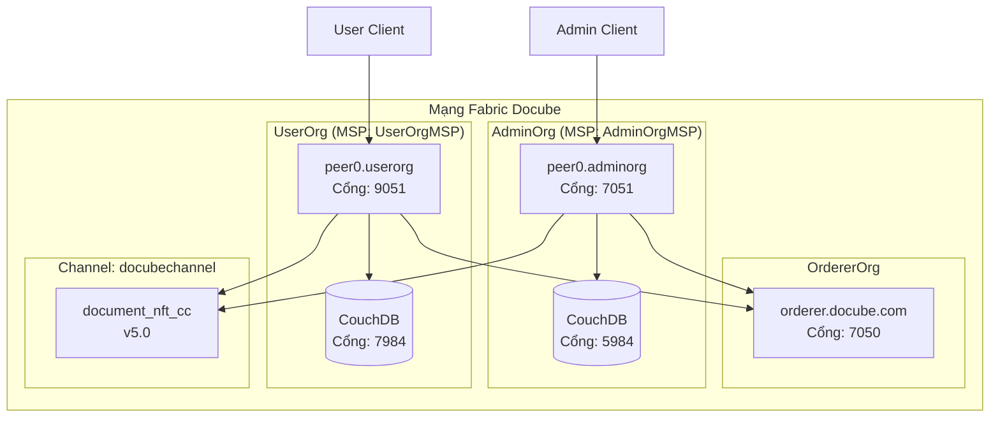
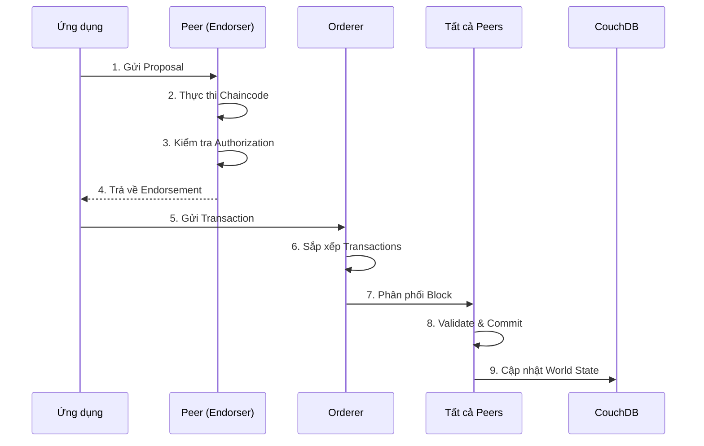
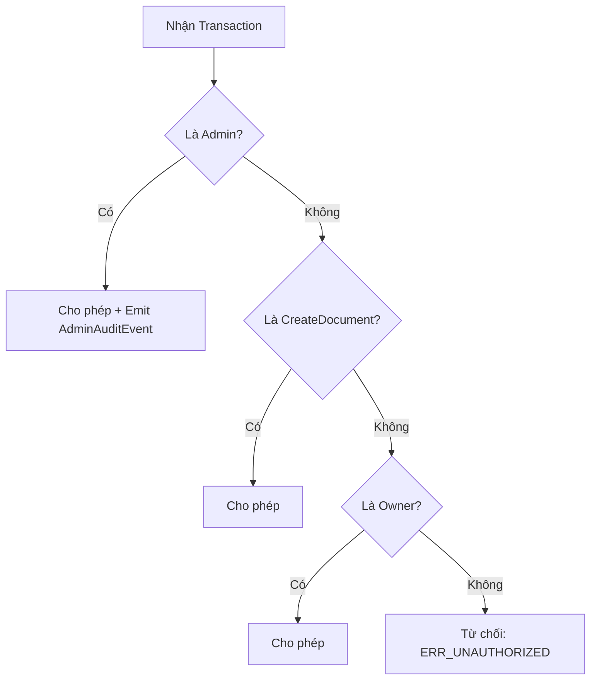

# KIẾN TRÚC MẠNG - Docube Fabric Network

**Phiên bản tài liệu:** 1.0  
**Cập nhật lần cuối:** 2026-02-01  
**Tác giả:** Đội ngũ Docube Engineering

---

## Mục đích
Tài liệu này mô tả kiến trúc mạng Hyperledger Fabric hoàn chỉnh cho Hệ thống Quản lý Tài liệu Docube.

## Phạm vi
- Topology mạng
- Cấu trúc tổ chức
- Cấu hình channel
- Certificate Authority
- Luồng transaction

## Đối tượng
- Kỹ sư DevOps
- Lập trình viên Blockchain
- Quản trị viên hệ thống
- Kiểm toán viên

## Giả định
- Fabric v2.5+ đã được cài đặt
- Docker và Docker Compose khả dụng
- Hiểu biết cơ bản về Hyperledger Fabric

## Tài liệu liên quan
- [NETWORK_CONFIG_FILES_VI.md](NETWORK_CONFIG_FILES_VI.md)
- [PERMISSION_MATRIX_VI.md](PERMISSION_MATRIX_VI.md)

---

## 1. Tổng quan Mạng

Mạng Docube là mạng blockchain có phép (permissioned) được xây dựng trên Hyperledger Fabric, thiết kế cho quản lý tài liệu doanh nghiệp với tính năng theo dõi quyền sở hữu dựa trên NFT.

### 1.1 Thành phần chính

| Thành phần | Mô tả |
|------------|-------|
| **2 Peer Organization** | AdminOrg (Quản trị), UserOrg (Người dùng) |
| **1 Orderer Organization** | OrdererOrg (Raft consensus) |
| **1 Channel** | docubechannel |
| **1 Chaincode** | document_nft_cc v5.0 |
| **State Database** | CouchDB (rich queries) |

---

## 2. Sơ đồ Kiến trúc



---

## 3. Các Tổ chức (Organizations)

### 3.1 OrdererOrg

| Thuộc tính | Giá trị |
|------------|---------|
| **Tên** | OrdererOrg |
| **MSP ID** | OrdererMSP |
| **Vai trò** | Sắp xếp transaction (Raft consensus) |
| **Orderer** | orderer.docube.com:7050 |
| **Cổng Admin** | 7053 |

### 3.2 AdminOrg

| Thuộc tính | Giá trị |
|------------|---------|
| **Tên** | AdminOrgMSP |
| **MSP ID** | AdminOrgMSP |
| **Vai trò** | Quản trị viên hệ thống, quyền đầy đủ |
| **Peer** | peer0.adminorg.docube.com:7051 |
| **CouchDB** | localhost:5984 |

**Quyền hạn:**
- ✅ Tạo, Cập nhật, Xóa tài liệu
- ✅ Cấp/Thu hồi quyền truy cập
- ✅ Override bất kỳ tài liệu nào (đặc quyền Admin)
- ✅ Deploy/upgrade chaincode
- ✅ Quản trị channel

### 3.3 UserOrg

| Thuộc tính | Giá trị |
|------------|---------|
| **Tên** | UserOrgMSP |
| **MSP ID** | UserOrgMSP |
| **Vai trò** | Tổ chức người dùng thông thường |
| **Peer** | peer0.userorg.docube.com:9051 |
| **CouchDB** | localhost:7984 |

**Quyền hạn:**
- ✅ Tạo tài liệu (trở thành OWNER)
- ✅ Cập nhật/Xóa chỉ tài liệu CỦA MÌNH
- ✅ Query tất cả tài liệu
- ❌ Không thể sửa tài liệu của người khác
- ❌ Không thể override (không phải Admin)

---

## 4. Cấu hình Channel

### 4.1 Channel: docubechannel

| Cài đặt | Giá trị |
|---------|---------|
| **Tên** | docubechannel |
| **Thành viên** | AdminOrg, UserOrg |
| **Orderer** | OrdererOrg (Raft) |
| **Kích thước Block** | Tối đa 10 messages / 99MB |
| **Block Timeout** | 2 giây |

### 4.2 Channel Policies

```yaml
Channel Policies:
  Readers:   ANY - Cả hai org đều có thể đọc
  Writers:   ANY - Cả hai org đều có thể gửi transaction
  Admins:    AdminOrgMSP.admin - Chỉ AdminOrg mới có thể sửa channel

Application Policies:
  Endorsement: OR('AdminOrgMSP.peer') - AdminOrg endorse writes
  LifecycleEndorsement: OR('AdminOrgMSP.peer') - AdminOrg deploy chaincode
```

---

## 5. Certificate Authority

Mạng sử dụng công cụ **cryptogen** để tạo chứng chỉ:

```
organizations/
├── ordererOrganizations/
│   └── docube.com/
│       ├── ca/                 # Orderer CA
│       ├── msp/                # Orderer MSP
│       └── orderers/           # Chứng chỉ orderer node
├── peerOrganizations/
│   ├── adminorg.docube.com/
│   │   ├── ca/                 # AdminOrg CA
│   │   ├── msp/                # AdminOrg MSP
│   │   ├── peers/              # Chứng chỉ peer
│   │   └── users/              # Chứng chỉ user
│   └── userorg.docube.com/
│       ├── ca/                 # UserOrg CA
│       ├── msp/                # UserOrg MSP
│       ├── peers/              # Chứng chỉ peer
│       └── users/              # Chứng chỉ user
```

---

## 6. Luồng Transaction

### 6.1 Sơ đồ Luồng Transaction



### 6.2 Luồng Authorization (Tầng Chaincode)



---

## 7. Endpoints Mạng

| Dịch vụ | Host | Cổng | Giao thức |
|---------|------|------|-----------|
| Orderer | orderer.docube.com | 7050 | gRPC/TLS |
| Orderer Admin | orderer.docube.com | 7053 | gRPC/TLS |
| AdminOrg Peer | peer0.adminorg.docube.com | 7051 | gRPC/TLS |
| UserOrg Peer | peer0.userorg.docube.com | 9051 | gRPC/TLS |
| AdminOrg CouchDB | localhost | 5984 | HTTP |
| UserOrg CouchDB | localhost | 7984 | HTTP |

---

## 8. Tính năng Bảo mật

### 8.1 Cấu hình TLS
- Tất cả giao tiếp được mã hóa TLS
- Mutual TLS cho orderer cluster
- Xác thực dựa trên chứng chỉ

### 8.2 MSP (Membership Service Provider)
- Chứng chỉ X.509 cho định danh
- Truy cập dựa trên vai trò (admin, peer, client)
- Cách ly theo tổ chức

### 8.3 Bảo mật tầng Chaincode
- Authorization dựa trên vai trò: USER / OWNER / ADMIN
- Các hành động Admin được ghi audit (AdminAction events)
- Optimistic locking ngăn chặn race conditions

---

## 9. State Database (CouchDB)

| Tính năng | Mô tả |
|-----------|-------|
| **Loại** | Apache CouchDB 3.3.2 |
| **Mục đích** | Rich queries trên dữ liệu JSON |
| **Databases** | `docubechannel_document_nft_cc` |
| **Truy cập** | Admin UI tại cổng 5984/7984 |
| **Thông tin đăng nhập** | admin / adminpw |

### 9.1 Khả năng Query
```javascript
// Ví dụ CouchDB selector
{
  "selector": {
    "status": "ACTIVE",
    "ownerId": "user123"
  }
}
```

---

## 10. Giám sát

| Endpoint | Mục đích |
|----------|----------|
| `orderer:9443/healthz` | Sức khỏe Orderer |
| `peer0.adminorg:9444/healthz` | Sức khỏe peer AdminOrg |
| `peer0.userorg:9445/healthz` | Sức khỏe peer UserOrg |
| Prometheus metrics | Khả dụng tại operations ports |

---

## Lịch sử Tài liệu

| Phiên bản | Ngày | Tác giả | Thay đổi |
|-----------|------|---------|----------|
| 1.0 | 2026-02-01 | Đội Docube | Tài liệu ban đầu |
