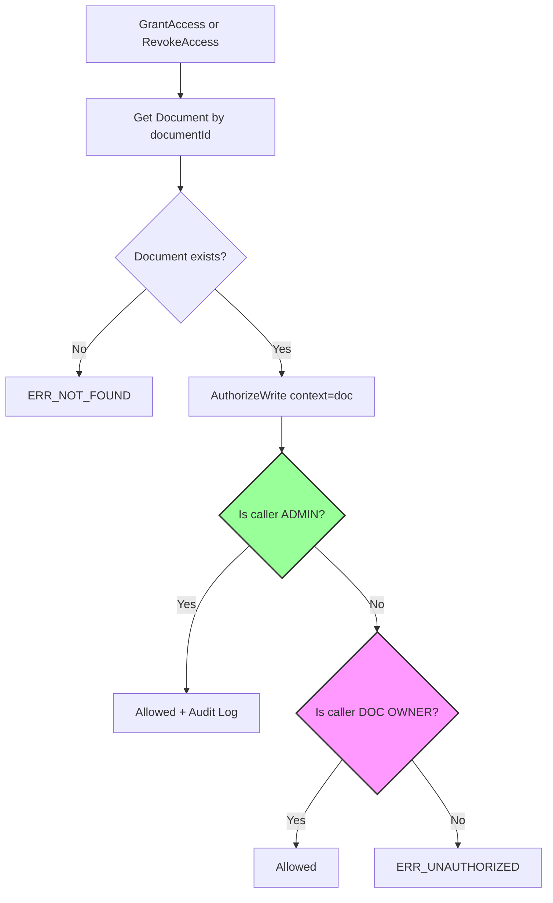
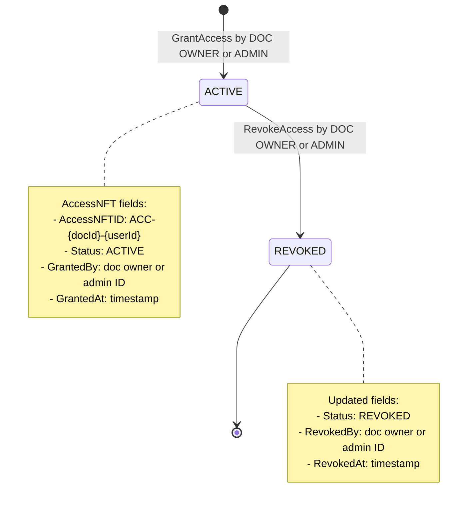

# PERMISSION MATRIX - Docube Chaincode

**Document Version:** 2.0  
**Last Updated:** 2026-02-01

---

## Purpose
This document provides the complete permission matrix for all chaincode functions (both DocumentContract and AccessContract), verified against actual code implementation.

## Scope
- Role definitions
- Permission matrix for Documents AND Access
- Code verification
- Test scenarios

## Audience
- Security Auditors
- Developers
- QA Engineers

## References
- [CODE_ARCHITECTURE_EN.md](CODE_ARCHITECTURE_EN.md)
- [FUNCTION_FLOWS_EN.md](FUNCTION_FLOWS_EN.md)

---

## 1. Role Definitions

### 1.1 USER (Default)

| Attribute | Description |
|-----------|-------------|
| **Definition** | Any valid identity enrolled in the network |
| **Identification** | Anyone not matching ADMIN or OWNER criteria |
| **Permissions** | Create documents, query all data |

### 1.2 OWNER (Document-Level)

| Attribute | Description |
|-----------|-------------|
| **Definition** | The creator/current owner of a specific document |
| **Identification** | `caller.ID == document.OwnerID` |
| **Permissions** | Full control over their own documents AND access to those documents |

### 1.3 ADMIN (Network-Level)

| Attribute | Description |
|-----------|-------------|
| **Definition** | System administrator with full override capabilities |
| **Identification** | `MSP ID == AdminOrgMSP` OR `cert.attribute["role"] == "admin"` |
| **Permissions** | Full access to all operations on all documents and access NFTs |

---

## 2. Permission Matrix

### 2.1 DocumentContract Operations

| Function | USER | OWNER | ADMIN | Code Reference |
|----------|:----:|:-----:|:-----:|----------------|
| CreateDocument | ✅ | ✅ | ✅ | document_contract.go:20-85 |
| UpdateDocument | ❌ | ✅ | ✅ | document_contract.go:87-166 |
| SoftDeleteDocument | ❌ | ✅ | ✅ | document_contract.go:239-308 |
| TransferOwnership | ❌ | ✅ | ✅ | document_contract.go:168-237 |
| GetDocument | ✅ | ✅ | ✅ | document_contract.go:314-335 |
| GetAllDocuments | ✅ | ✅ | ✅ | document_contract.go:337-370 |
| GetDocumentHistory | ✅ | ✅ | ✅ | document_contract.go:372-417 |

### 2.2 AccessContract Operations

| Function | USER | DOC OWNER | ADMIN | Code Reference |
|----------|:----:|:---------:|:-----:|----------------|
| **GrantAccess** | ❌ | ✅ | ✅ | access_contract.go:20-115 |
| **RevokeAccess** | ❌ | ✅ | ✅ | access_contract.go:117-203 |
| GetAccess | ✅ | ✅ | ✅ | access_contract.go:209-232 |
| GetAllAccessByDocument | ✅ | ✅ | ✅ | access_contract.go:234-268 |
| GetAllAccessByUser | ✅ | ✅ | ✅ | access_contract.go:270-305 |
| GetAccessHistory | ✅ | ✅ | ✅ | access_contract.go:307-353 |

> **Important:** For GrantAccess and RevokeAccess, "OWNER" means the **Document Owner**, not the Access holder.

### 2.3 Complete Summary Matrix

```
┌─────────────────────────┬───────┬───────────┬───────┐
│ Function                │ USER  │ DOC OWNER │ ADMIN │
├─────────────────────────┼───────┼───────────┼───────┤
│ DocumentContract        │       │           │       │
├─────────────────────────┼───────┼───────────┼───────┤
│ CreateDocument          │  ✅   │    ✅     │  ✅   │
│ UpdateDocument          │  ❌   │    ✅     │  ✅   │
│ SoftDeleteDocument      │  ❌   │    ✅     │  ✅   │
│ TransferOwnership       │  ❌   │    ✅     │  ✅   │
│ Query Functions (3)     │  ✅   │    ✅     │  ✅   │
├─────────────────────────┼───────┼───────────┼───────┤
│ AccessContract          │       │           │       │
├─────────────────────────┼───────┼───────────┼───────┤
│ GrantAccess             │  ❌   │    ✅     │  ✅   │
│ RevokeAccess            │  ❌   │    ✅     │  ✅   │
│ Query Functions (4)     │  ✅   │    ✅     │  ✅   │
└─────────────────────────┴───────┴───────────┴───────┘
```

---

## 3. AccessNFT Authorization Details

### 3.1 Key Insight

> **GrantAccess and RevokeAccess check the DOCUMENT owner, not the AccessNFT owner.**

This means:
- The person who creates a document can grant/revoke access to anyone
- The person who receives access CANNOT revoke their own access
- Only the document owner or admin can manage access

### 3.2 Authorization Flow for AccessContract



### 3.3 Code Verification

**GrantAccess Authorization (access_contract.go:57-60):**
```go
// Authorization check (ADMIN > OWNER > reject)
// Note: doc is passed, so we check DOC owner, not access owner
authResult, err := AuthorizeWrite(ctx, doc, "GrantAccess")
if err != nil {
    return err  // ERR_UNAUTHORIZED if not doc owner or admin
}
```

**RevokeAccess Authorization (access_contract.go:147-150):**
```go
// Authorization check (ADMIN > OWNER > reject)
authResult, err := AuthorizeWrite(ctx, doc, "RevokeAccess")
if err != nil {
    return err  // ERR_UNAUTHORIZED if not doc owner or admin
}
```

---

## 4. Access NFT Lifecycle

### 4.1 State Diagram



### 4.2 AccessNFT Fields

| Field | Set By | When |
|-------|--------|------|
| AccessNFTID | System | GrantAccess |
| DocumentID | Caller | GrantAccess |
| OwnerID | Caller | GrantAccess (grantee's ID) |
| OwnerMSP | Caller | GrantAccess (grantee's MSP) |
| SystemUserId | Caller | GrantAccess |
| Status | System | GrantAccess→ACTIVE, RevokeAccess→REVOKED |
| GrantedBy | System | GrantAccess (caller.ID) |
| GrantedAt | System | GrantAccess (tx timestamp) |
| RevokedBy | System | RevokeAccess (caller.ID) |
| RevokedAt | System | RevokeAccess (tx timestamp) |

---

## 5. Admin Audit Trail

### 5.1 Admin Actions on AccessContract

When ADMIN performs access operations, an `AdminAction` event is emitted:

```go
// access_contract.go:102-106
if authResult.IsAdmin {
    if err := EmitAdminAuditEvent(ctx, "GrantAccess", accessNFT.AccessNFTID, documentID, ""); err != nil {
        return err
    }
}
```

### 5.2 Audit Payload

```go
AdminAuditPayload{
    AssetID:    "ACC-doc1-user1",  // AccessNFT ID
    DocumentID: "doc1",
    Action:     "GrantAccess" or "RevokeAccess",
    ActorID:    "admin-identity",
    ActorMSP:   "AdminOrgMSP",
    Role:       "ADMIN",
    Reason:     "",
    Timestamp:  "2026-02-01T16:44:00Z",
    TxID:       "abc123...",
}
```

---

## 6. Test Scenarios

### 6.1 Document Operations

| Test | Expected | Verified |
|------|----------|----------|
| USER creates document | ✅ Success, becomes OWNER | ✅ |
| OWNER updates own doc | ✅ Success | ✅ |
| NON-OWNER updates doc | ❌ ERR_UNAUTHORIZED | ✅ |
| ADMIN updates any doc | ✅ Success + Audit | ✅ |

### 6.2 Access Operations

| Test | Expected | Verified |
|------|----------|----------|
| DOC OWNER grants access | ✅ AccessNFT created | ✅ |
| NON-OWNER grants access | ❌ ERR_UNAUTHORIZED | ✅ |
| ADMIN grants access to any doc | ✅ Success + Audit | ✅ |
| DOC OWNER revokes access | ✅ Status→REVOKED | ✅ |
| ACCESS HOLDER revokes own access | ❌ ERR_UNAUTHORIZED | ✅ |
| ADMIN revokes access on any doc | ✅ Success + Audit | ✅ |
| Query access (any user) | ✅ Success | ✅ |

### 6.3 Test Commands

```bash
# GrantAccess - by document owner
source setEnv.sh adminorg
peer chaincode invoke ... -c '{"function":"access:GrantAccess","Args":["doc-001","user-123","UserOrgMSP","sys-user-1"]}'

# RevokeAccess - by document owner
peer chaincode invoke ... -c '{"function":"access:RevokeAccess","Args":["doc-001","user-123"]}'

# Query access
peer chaincode query ... -c '{"function":"access:GetAccess","Args":["doc-001","user-123"]}'

# Query all access for document
peer chaincode query ... -c '{"function":"access:GetAllAccessByDocument","Args":["doc-001"]}'

# Query all access for user
peer chaincode query ... -c '{"function":"access:GetAllAccessByUser","Args":["user-123"]}'
```

---

## 7. Security Considerations

| Risk | Mitigation |
|------|------------|
| Admin abuse | All admin actions logged with AdminAction event |
| Ownership spoofing | Identity from x509 certificate, not parameter |
| Access holder revokes own access | Not allowed - must be doc owner or admin |
| Race condition on document | Optimistic locking with version checks |
| Deleted doc access management | Document status validated before access operations |

---

## Document History

| Version | Date | Author | Changes |
|---------|------|--------|---------|
| 1.0 | 2026-02-01 | Docube Team | Initial document |
| 2.0 | 2026-02-01 | Docube Team | Added full AccessContract permissions |
