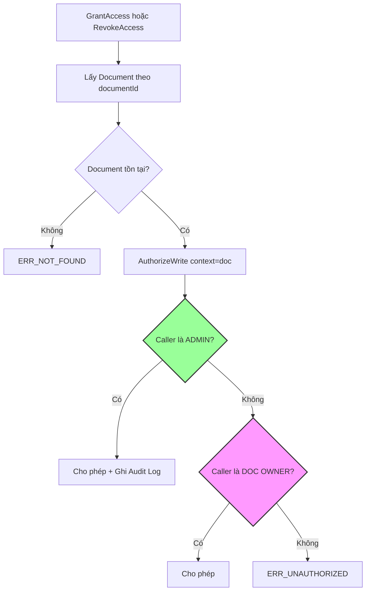
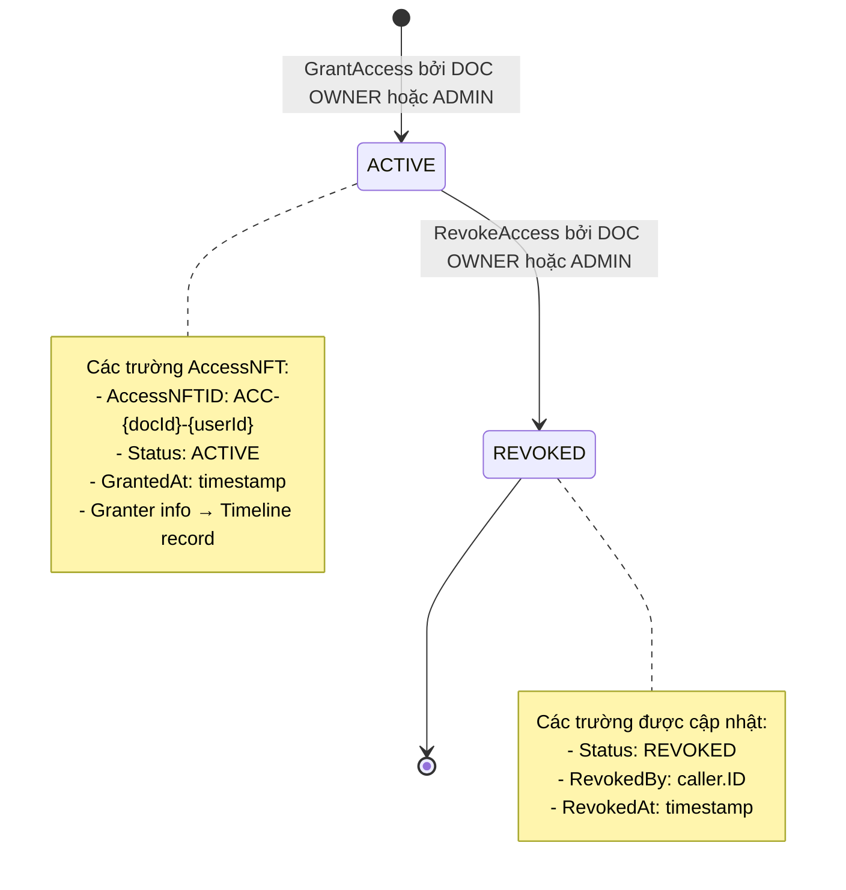

# MA TRẬN QUYỀN - Docube Chaincode

**Phiên bản tài liệu:** 3.0
**Cập nhật lần cuối:** 2026-03-10

---

## Mục đích
Tài liệu này cung cấp ma trận quyền đầy đủ cho tất cả các hàm chaincode (cả DocumentContract và AccessContract), được xác minh với code thực tế.

## Phạm vi
- Định nghĩa vai trò
- Ma trận quyền cho Documents VÀ Access
- Xác minh code
- Kịch bản test

## Đối tượng
- Kiểm toán viên bảo mật
- Lập trình viên
- QA Engineers

## Tài liệu liên quan
- [CODE_ARCHITECTURE_VI.md](CODE_ARCHITECTURE_VI.md)
- [FUNCTION_FLOWS_VI.md](FUNCTION_FLOWS_VI.md)
- [BLOCKCHAIN_SERVICE_VI.md](BLOCKCHAIN_SERVICE_VI.md)

---

## 1. Định nghĩa Vai trò

### 1.1 USER (Mặc định)

| Thuộc tính | Mô tả |
|------------|-------|
| **Định nghĩa** | Bất kỳ danh tính hợp lệ nào đã đăng ký trong mạng |
| **Nhận dạng** | Bất kỳ ai không phù hợp với tiêu chí ADMIN hoặc OWNER |
| **Quyền** | Tạo tài liệu, query tất cả dữ liệu |

### 1.2 OWNER (Cấp Document)

| Thuộc tính | Mô tả |
|------------|-------|
| **Định nghĩa** | Người tạo/chủ sở hữu hiện tại của một tài liệu cụ thể |
| **Nhận dạng** | `caller.ID == document.OwnerID` |
| **Quyền** | Toàn quyền kiểm soát tài liệu của mình VÀ quyền truy cập tài liệu đó |

### 1.3 ADMIN (Cấp Mạng)

| Thuộc tính | Mô tả |
|------------|-------|
| **Định nghĩa** | Quản trị viên hệ thống với quyền override đầy đủ |
| **Nhận dạng** | `MSP ID == AdminOrgMSP` HOẶC `cert.attribute["role"] == "admin"` |
| **Quyền** | Toàn quyền trên tất cả documents và access NFTs |

---

## 2. Ma trận Quyền

### 2.1 Các thao tác DocumentContract

| Chức năng | USER | OWNER | ADMIN | Tham chiếu Code |
|-----------|:----:|:-----:|:-----:|-----------------|
| CreateDocument | ✅ | ✅ | ✅ | document_contract.go:20-85 |
| UpdateDocument | ❌ | ✅ | ✅ | document_contract.go:87-166 |
| SoftDeleteDocument | ❌ | ✅ | ✅ | document_contract.go:239-308 |
| TransferOwnership | ❌ | ✅ | ✅ | document_contract.go:168-237 |
| GetDocument | ✅ | ✅ | ✅ | document_contract.go:314-335 |
| GetAllDocuments | ✅ | ✅ | ✅ | document_contract.go:337-370 |
| GetDocumentHistory | ✅ | ✅ | ✅ | document_contract.go:372-417 |

### 2.2 Các thao tác AccessContract

| Chức năng | USER | DOC OWNER | ADMIN | Tham chiếu Code |
|-----------|:----:|:---------:|:-----:|-----------------|
| **GrantAccess** | ❌ | ✅ | ✅ | access_contract.go:20-115 |
| **RevokeAccess** | ❌ | ✅ | ✅ | access_contract.go:117-203 |
| GetAccess | ✅ | ✅ | ✅ | access_contract.go:209-232 |
| GetAllAccessByDocument | ✅ | ✅ | ✅ | access_contract.go:234-268 |
| GetAllAccessByUser | ✅ | ✅ | ✅ | access_contract.go:270-305 |
| GetAccessHistory | ✅ | ✅ | ✅ | access_contract.go:307-353 |

> **Quan trọng:** Với GrantAccess và RevokeAccess, "OWNER" có nghĩa là **Document Owner**, không phải Access holder.

### 2.3 Bảng Tóm tắt Đầy đủ

```
┌─────────────────────────┬───────┬───────────┬───────┐
│ Chức năng               │ USER  │ DOC OWNER │ ADMIN │
├─────────────────────────┼───────┼───────────┼───────┤
│ DocumentContract        │       │           │       │
├─────────────────────────┼───────┼───────────┼───────┤
│ CreateDocument          │  ✅   │    ✅     │  ✅   │
│ UpdateDocument          │  ❌   │    ✅     │  ✅   │
│ SoftDeleteDocument      │  ❌   │    ✅     │  ✅   │
│ TransferOwnership       │  ❌   │    ✅     │  ✅   │
│ Các hàm Query (3)       │  ✅   │    ✅     │  ✅   │
├─────────────────────────┼───────┼───────────┼───────┤
│ AccessContract          │       │           │       │
├─────────────────────────┼───────┼───────────┼───────┤
│ GrantAccess             │  ❌   │    ✅     │  ✅   │
│ RevokeAccess            │  ❌   │    ✅     │  ✅   │
│ Các hàm Query (4)       │  ✅   │    ✅     │  ✅   │
└─────────────────────────┴───────┴───────────┴───────┘
```

---

## 3. Chi tiết Authorization AccessNFT

### 3.1 Điểm Quan trọng

> **GrantAccess và RevokeAccess kiểm tra DOCUMENT owner, không phải AccessNFT owner.**

Điều này có nghĩa:
- Người tạo document có thể cấp/thu hồi quyền cho bất kỳ ai
- Người nhận quyền truy cập KHÔNG THỂ thu hồi quyền của chính mình
- Chỉ document owner hoặc admin mới có thể quản lý access

### 3.2 Luồng Authorization cho AccessContract



### 3.3 Xác minh Code

**Authorization GrantAccess (access_contract.go:57-60):**
```go
// Kiểm tra authorization (ADMIN > OWNER > từ chối)
// Lưu ý: doc được truyền vào, nên kiểm tra DOC owner, không phải access owner
authResult, err := AuthorizeWrite(ctx, doc, "GrantAccess")
if err != nil {
    return err  // ERR_UNAUTHORIZED nếu không phải doc owner hoặc admin
}
```

**Authorization RevokeAccess (access_contract.go:147-150):**
```go
// Kiểm tra authorization (ADMIN > OWNER > từ chối)
authResult, err := AuthorizeWrite(ctx, doc, "RevokeAccess")
if err != nil {
    return err  // ERR_UNAUTHORIZED nếu không phải doc owner hoặc admin
}
```

---

## 4. Vòng đời Access NFT

### 4.1 Sơ đồ Trạng thái



### 4.2 Các trường AccessNFT

| Trường | Đặt bởi | Khi nào |
|--------|---------|---------|
| AccessNFTID | Hệ thống | GrantAccess |
| DocumentID | Caller | GrantAccess |
| OwnerID | Caller | GrantAccess (Fabric identity người nhận) |
| OwnerMSP | Caller | GrantAccess (MSP người nhận) |
| SystemUserId | Caller | GrantAccess (app-layer ID người nhận) |
| Status | Hệ thống | GrantAccess→ACTIVE, RevokeAccess→REVOKED |
| GrantedAt | Hệ thống | GrantAccess (tx timestamp) |
| RevokedBy | Hệ thống | RevokeAccess (caller.ID) |
| RevokedAt | Hệ thống | RevokeAccess (tx timestamp) |

> **Lưu ý:** `GrantedBy` đã bị loại bỏ. Thông tin granter theo dõi qua Timeline record.

---

## 5. Dấu vết Kiểm toán Admin

### 5.1 Hành động Admin trên AccessContract

Khi ADMIN thực hiện thao tác access, một event `AdminAction` được phát:

```go
// access_contract.go:102-106
if authResult.IsAdmin {
    if err := EmitAdminAuditEvent(ctx, "GrantAccess", accessNFT.AccessNFTID, documentID, ""); err != nil {
        return err
    }
}
```

### 5.2 Audit Payload

```go
AdminAuditPayload{
    AssetID:    "ACC-doc1-user1",  // AccessNFT ID
    DocumentID: "doc1",
    Action:     "GrantAccess" hoặc "RevokeAccess",
    ActorID:    "admin-identity",
    ActorMSP:   "AdminOrgMSP",
    Role:       "ADMIN",
    Reason:     "",
    Timestamp:  "2026-02-01T16:44:00Z",
    TxID:       "abc123...",
}
```

---

## 6. Kịch bản Test

### 6.1 Thao tác Document

| Test | Mong đợi | Đã xác minh |
|------|----------|-------------|
| USER tạo document | ✅ Thành công, trở thành OWNER | ✅ |
| OWNER update doc của mình | ✅ Thành công | ✅ |
| NON-OWNER update doc | ❌ ERR_UNAUTHORIZED | ✅ |
| ADMIN update bất kỳ doc | ✅ Thành công + Audit | ✅ |

### 6.2 Thao tác Access

| Test | Mong đợi | Đã xác minh |
|------|----------|-------------|
| DOC OWNER cấp access | ✅ AccessNFT được tạo | ✅ |
| NON-OWNER cấp access | ❌ ERR_UNAUTHORIZED | ✅ |
| ADMIN cấp access cho bất kỳ doc | ✅ Thành công + Audit | ✅ |
| DOC OWNER thu hồi access | ✅ Status→REVOKED | ✅ |
| ACCESS HOLDER tự thu hồi access | ❌ ERR_UNAUTHORIZED | ✅ |
| ADMIN thu hồi access trên bất kỳ doc | ✅ Thành công + Audit | ✅ |
| Query access (bất kỳ user) | ✅ Thành công | ✅ |

### 6.3 Lệnh Test

```bash
# GrantAccess - bởi document owner
source setEnv.sh adminorg
peer chaincode invoke ... -c '{"function":"access:GrantAccess","Args":["doc-001","user-123","UserOrgMSP","sys-user-1"]}'

# RevokeAccess - bởi document owner
peer chaincode invoke ... -c '{"function":"access:RevokeAccess","Args":["doc-001","user-123"]}'

# Query access
peer chaincode query ... -c '{"function":"access:GetAccess","Args":["doc-001","user-123"]}'

# Query tất cả access cho document
peer chaincode query ... -c '{"function":"access:GetAllAccessByDocument","Args":["doc-001"]}'

# Query tất cả access cho user
peer chaincode query ... -c '{"function":"access:GetAllAccessByUser","Args":["user-123"]}'
```

---

## 7. Cân nhắc Bảo mật

| Rủi ro | Giảm thiểu |
|--------|------------|
| Lạm dụng admin | Tất cả hành động admin được log với AdminAction event |
| Giả mạo ownership | Danh tính từ chứng chỉ x509, không phải tham số |
| Access holder tự thu hồi access | Không được phép - phải là doc owner hoặc admin |
| Race condition trên document | Khóa lạc quan với kiểm tra version |
| Quản lý access doc đã xóa | Status document được validate trước thao tác access |

---

## Lịch sử Tài liệu

| Phiên bản | Ngày | Tác giả | Thay đổi |
|-----------|------|---------|----------|
| 1.0 | 2026-02-01 | Đội Docube | Tài liệu ban đầu |
| 2.0 | 2026-02-01 | Đội Docube | Thêm đầy đủ quyền AccessContract |
| 3.0 | 2026-03-10 | Đội Docube | Loại bỏ GrantedBy, cập nhật AccessNFT lifecycle |
