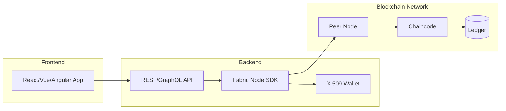
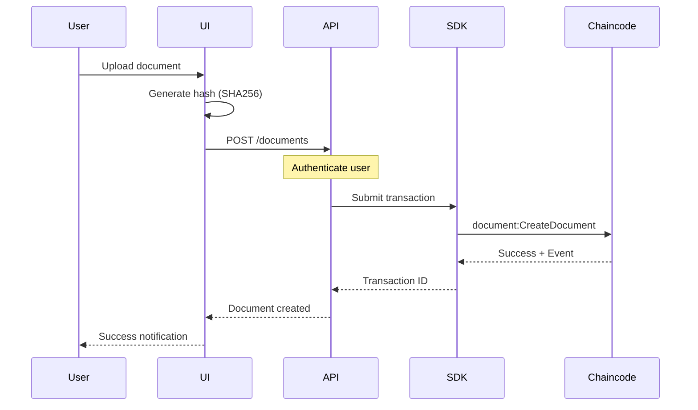
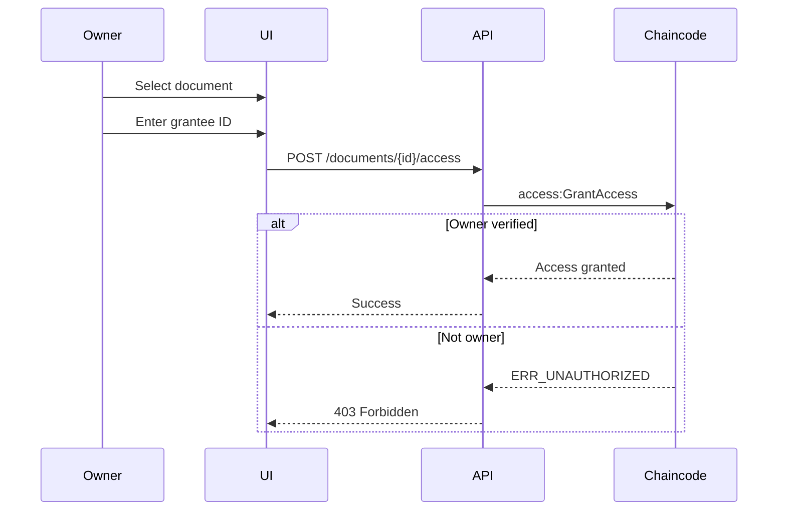
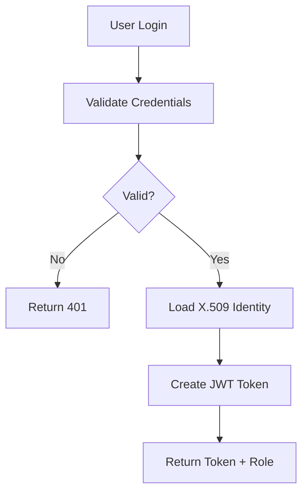

# UI WORKSPACE GUIDE - Docube System

**Document Version:** 1.0  
**Last Updated:** 2026-02-01

---

## Purpose
This document explains how UI applications integrate with the Docube Fabric backend.

## Scope
- UI architecture overview
- API mapping to chaincode
- Best practices
- Common pitfalls

## Audience
- Frontend Developers
- Full-stack Developers
- Solution Architects

## References
- [CODE_ARCHITECTURE_EN.md](CODE_ARCHITECTURE_EN.md)
- [FUNCTION_FLOWS_EN.md](FUNCTION_FLOWS_EN.md)

---

## 1. Integration Architecture

### 1.1 Architecture Diagram



### 1.2 Component Responsibilities

| Component | Responsibility |
|-----------|----------------|
| **UI** | User interface, form validation, display |
| **API** | Authentication, business logic, gateway |
| **SDK** | Fabric communication, transaction submission |
| **Wallet** | Identity management, X.509 certificates |
| **Peer** | Endorsement, chaincode execution |
| **Chaincode** | Business rules, authorization |

---

## 2. User Flow Mapping

### 2.1 Create Document Flow



### 2.2 Grant Access Flow



---

## 3. API to Chaincode Mapping

### 3.1 Document Endpoints

| HTTP Endpoint | Chaincode Function | Parameters |
|---------------|-------------------|------------|
| `POST /documents` | `document:CreateDocument` | documentId, hash, algo, systemUserId |
| `PUT /documents/{id}` | `document:UpdateDocument` | documentId, hash, algo, version |
| `DELETE /documents/{id}` | `document:SoftDeleteDocument` | documentId |
| `GET /documents/{id}` | `document:GetDocument` | documentId |
| `GET /documents` | `document:GetAllDocuments` | - |
| `GET /documents/{id}/history` | `document:GetDocumentHistory` | documentId |
| `POST /documents/{id}/transfer` | `document:TransferOwnership` | documentId, newOwnerId, newOwnerMsp |

### 3.2 Access Endpoints

| HTTP Endpoint | Chaincode Function | Parameters |
|---------------|-------------------|------------|
| `POST /documents/{id}/access` | `access:GrantAccess` | documentId, granteeId, granteeMsp, systemUserId |
| `DELETE /documents/{id}/access/{userId}` | `access:RevokeAccess` | documentId, userId |
| `GET /documents/{id}/access` | `access:GetAllAccessByDocument` | documentId |
| `GET /users/{id}/access` | `access:GetAllAccessByUser` | userId |

---

## 4. Identity Management

### 4.1 User Authentication



### 4.2 Role Determination

| Source | Role | UI Behavior |
|--------|------|-------------|
| AdminOrgMSP identity | ADMIN | Show admin panel |
| Document owner | OWNER | Show edit/delete buttons |
| Other | USER | Show read-only, create |

### 4.3 Frontend Role Handling

```javascript
// Example role check in React
const DocumentActions = ({ document, currentUser }) => {
  const isAdmin = currentUser.mspId === 'AdminOrgMSP';
  const isOwner = currentUser.id === document.ownerId;
  
  if (!isAdmin && !isOwner) {
    return null; // Hide actions
  }
  
  return (
    <>
      <Button onClick={handleEdit}>Edit</Button>
      <Button onClick={handleDelete}>Delete</Button>
    </>
  );
};
```

---

## 5. Error Handling

### 5.1 Chaincode Errors to HTTP Mapping

| Chaincode Error | HTTP Status | User Message |
|-----------------|-------------|--------------|
| `ERR_NOT_FOUND` | 404 | Document not found |
| `ERR_ALREADY_EXISTS` | 409 | Document already exists |
| `ERR_UNAUTHORIZED` | 403 | You don't have permission |
| `ERR_VERSION_MISMATCH` | 409 | Document was modified, please refresh |
| `ERR_INVALID_STATE` | 400 | Document is deleted |

### 5.2 Error Handling Code

```javascript
// Backend error handler
async function invokeChaincode(fcn, args) {
  try {
    const result = await contract.submitTransaction(fcn, ...args);
    return { success: true, data: JSON.parse(result) };
  } catch (error) {
    const message = error.message;
    
    if (message.includes('ERR_NOT_FOUND')) {
      throw new NotFoundError('Resource not found');
    }
    if (message.includes('ERR_UNAUTHORIZED')) {
      throw new ForbiddenError('Permission denied');
    }
    if (message.includes('ERR_VERSION_MISMATCH')) {
      throw new ConflictError('Resource was modified');
    }
    
    throw new InternalError('Blockchain error');
  }
}
```

---

## 6. Best Practices

### 6.1 UI Best Practices

| Practice | Implementation |
|----------|----------------|
| Optimistic updates | Show success, rollback on error |
| Version conflict handling | Show "refresh" option |
| Role-based rendering | Check before showing buttons |
| Hash verification | Compute hash client-side |

### 6.2 Backend Best Practices

| Practice | Implementation |
|----------|----------------|
| Transaction retry | Retry on MVCC conflict |
| Event listening | Subscribe to chaincode events |
| Caching | Cache query results (with TTL) |
| Rate limiting | Prevent transaction flood |

### 6.3 Security Best Practices

| Practice | Implementation |
|----------|----------------|
| Never trust frontend | Always verify on backend |
| Identity from certificate | Don't use client-provided ID |
| Audit logging | Log all blockchain operations |
| JWT validation | Verify on every request |

---

## 7. Common Pitfalls

### 7.1 Frontend Pitfalls

| Pitfall | Solution |
|---------|----------|
| Assuming instant confirmation | Wait for commit, show loading |
| Not handling version conflicts | Implement refresh mechanism |
| Caching stale data | Invalidate on events |
| Trusting client-side role | Always verify server-side |

### 7.2 Integration Pitfalls

| Pitfall | Solution |
|---------|----------|
| Using user-provided identity | Extract from X.509 certificate |
| Not checking ownership | Use AuthorizeWrite pattern |
| Ignoring transaction events | Listen for real-time updates |
| Hard-coding MSP IDs | Use configuration |

---

## 8. Event Handling

### 8.1 Chaincode Events

```javascript
// Listen for chaincode events
const network = gateway.getNetwork('docubechannel');
const contract = network.getContract('document_nft_cc');

await contract.addContractListener(async (event) => {
  const eventName = event.eventName;
  const payload = JSON.parse(event.payload.toString());
  
  switch (eventName) {
    case 'DocumentCreated':
      // Notify UI, update cache
      break;
    case 'DocumentUpdated':
      // Invalidate cache, refresh UI
      break;
    case 'AdminAction':
      // Log for audit
      console.log('Admin action:', payload);
      break;
  }
});
```

---

## 9. Testing UI Integration

### 9.1 Test Scenarios

| Scenario | Expected Result |
|----------|-----------------|
| User creates document | Success, becomes owner |
| Owner edits document | Success |
| Non-owner edits | "Permission denied" error |
| Admin edits any document | Success |
| Version conflict | "Refresh required" prompt |

---

## Document History

| Version | Date | Author | Changes |
|---------|------|--------|---------|
| 1.0 | 2026-02-01 | Docube Team | Initial document |
