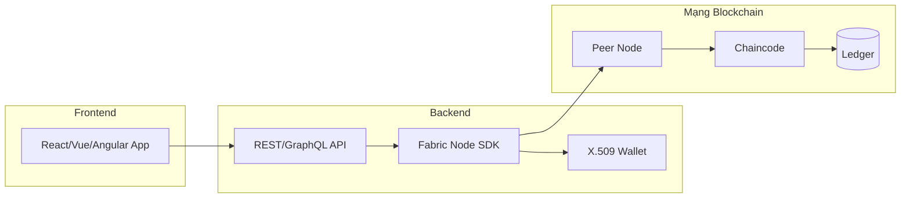
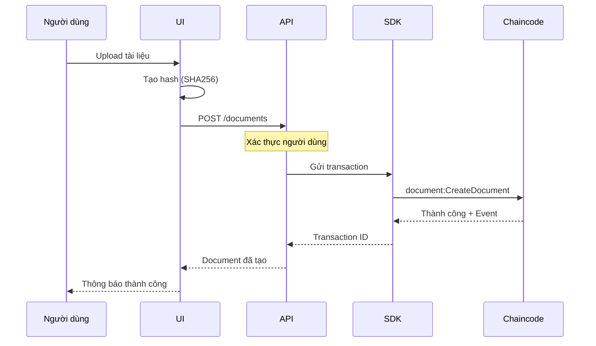
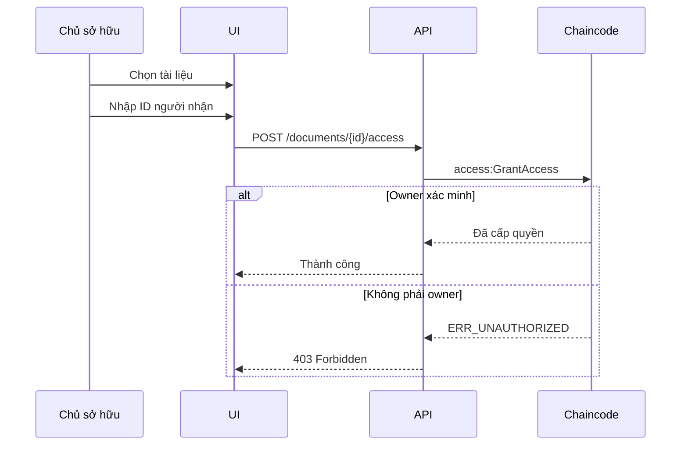
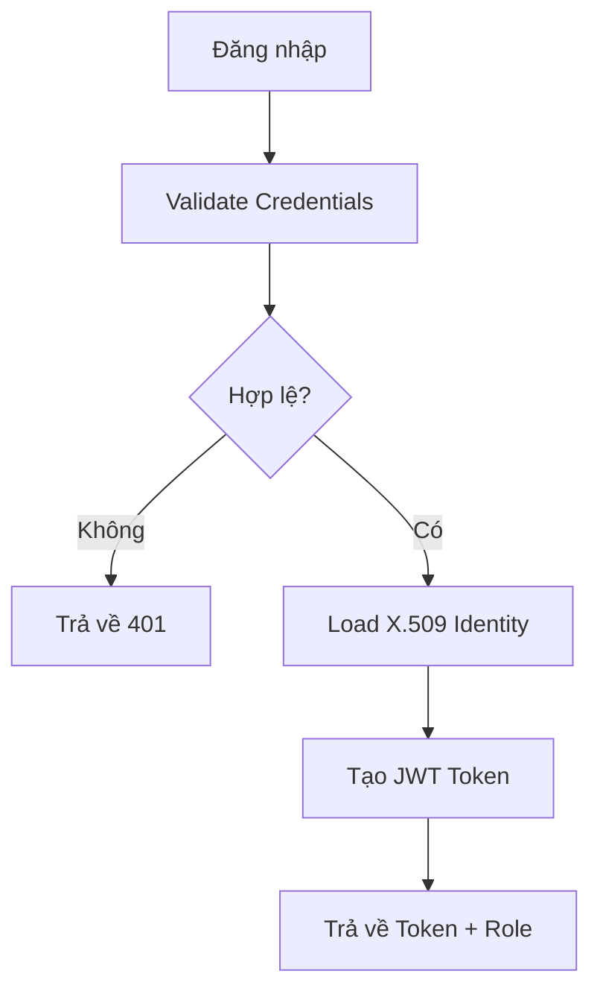

# HƯỚNG DẪN TÍCH HỢP UI - Docube System

**Phiên bản tài liệu:** 1.0  
**Cập nhật lần cuối:** 2026-02-01

---

## Mục đích
Tài liệu này giải thích cách ứng dụng UI tích hợp với backend Fabric của Docube.

## Phạm vi
- Tổng quan kiến trúc UI
- Ánh xạ API đến chaincode
- Best practices
- Các lỗi thường gặp

## Đối tượng
- Lập trình viên Frontend
- Lập trình viên Full-stack
- Solution Architects

## Tài liệu liên quan
- [CODE_ARCHITECTURE_VI.md](CODE_ARCHITECTURE_VI.md)
- [FUNCTION_FLOWS_VI.md](FUNCTION_FLOWS_VI.md)

---

## 1. Kiến trúc Tích hợp

### 1.1 Sơ đồ Kiến trúc



### 1.2 Trách nhiệm Thành phần

| Thành phần | Trách nhiệm |
|------------|-------------|
| **UI** | Giao diện người dùng, validate form, hiển thị |
| **API** | Xác thực, logic nghiệp vụ, gateway |
| **SDK** | Giao tiếp Fabric, gửi transaction |
| **Wallet** | Quản lý danh tính, chứng chỉ X.509 |
| **Peer** | Endorsement, thực thi chaincode |
| **Chaincode** | Quy tắc nghiệp vụ, authorization |

---

## 2. Ánh xạ Luồng Người dùng

### 2.1 Luồng Tạo Document



### 2.2 Luồng Cấp Quyền Truy cập



---

## 3. Ánh xạ API đến Chaincode

### 3.1 Document Endpoints

| HTTP Endpoint | Chaincode Function | Tham số |
|---------------|-------------------|---------|
| `POST /documents` | `document:CreateDocument` | documentId, hash, algo, systemUserId |
| `PUT /documents/{id}` | `document:UpdateDocument` | documentId, hash, algo, version |
| `DELETE /documents/{id}` | `document:SoftDeleteDocument` | documentId |
| `GET /documents/{id}` | `document:GetDocument` | documentId |
| `GET /documents` | `document:GetAllDocuments` | - |
| `GET /documents/{id}/history` | `document:GetDocumentHistory` | documentId |
| `POST /documents/{id}/transfer` | `document:TransferOwnership` | documentId, newOwnerId, newOwnerMsp |

### 3.2 Access Endpoints

| HTTP Endpoint | Chaincode Function | Tham số |
|---------------|-------------------|---------|
| `POST /documents/{id}/access` | `access:GrantAccess` | documentId, granteeId, granteeMsp, systemUserId |
| `DELETE /documents/{id}/access/{userId}` | `access:RevokeAccess` | documentId, userId |
| `GET /documents/{id}/access` | `access:GetAllAccessByDocument` | documentId |
| `GET /users/{id}/access` | `access:GetAllAccessByUser` | userId |

---

## 4. Quản lý Danh tính

### 4.1 Xác thực Người dùng



### 4.2 Xác định Role

| Nguồn | Role | Hành vi UI |
|-------|------|------------|
| AdminOrgMSP identity | ADMIN | Hiển thị admin panel |
| Document owner | OWNER | Hiển thị nút edit/delete |
| Khác | USER | Chỉ đọc, có thể tạo |

### 4.3 Xử lý Role phía Frontend

```javascript
// Ví dụ kiểm tra role trong React
const DocumentActions = ({ document, currentUser }) => {
  const isAdmin = currentUser.mspId === 'AdminOrgMSP';
  const isOwner = currentUser.id === document.ownerId;
  
  if (!isAdmin && !isOwner) {
    return null; // Ẩn actions
  }
  
  return (
    <>
      <Button onClick={handleEdit}>Sửa</Button>
      <Button onClick={handleDelete}>Xóa</Button>
    </>
  );
};
```

---

## 5. Xử lý Lỗi

### 5.1 Ánh xạ Lỗi Chaincode sang HTTP

| Lỗi Chaincode | HTTP Status | Thông báo Người dùng |
|---------------|-------------|----------------------|
| `ERR_NOT_FOUND` | 404 | Không tìm thấy tài liệu |
| `ERR_ALREADY_EXISTS` | 409 | Tài liệu đã tồn tại |
| `ERR_UNAUTHORIZED` | 403 | Bạn không có quyền |
| `ERR_VERSION_MISMATCH` | 409 | Tài liệu đã bị sửa, vui lòng refresh |
| `ERR_INVALID_STATE` | 400 | Tài liệu đã bị xóa |

### 5.2 Code Xử lý Lỗi

```javascript
// Backend error handler
async function invokeChaincode(fcn, args) {
  try {
    const result = await contract.submitTransaction(fcn, ...args);
    return { success: true, data: JSON.parse(result) };
  } catch (error) {
    const message = error.message;
    
    if (message.includes('ERR_NOT_FOUND')) {
      throw new NotFoundError('Không tìm thấy tài nguyên');
    }
    if (message.includes('ERR_UNAUTHORIZED')) {
      throw new ForbiddenError('Không có quyền truy cập');
    }
    if (message.includes('ERR_VERSION_MISMATCH')) {
      throw new ConflictError('Tài nguyên đã bị sửa');
    }
    
    throw new InternalError('Lỗi blockchain');
  }
}
```

---

## 6. Best Practices

### 6.1 Best Practices UI

| Thực hành | Triển khai |
|-----------|------------|
| Cập nhật lạc quan | Hiển thị thành công, rollback nếu lỗi |
| Xử lý xung đột version | Hiển thị tùy chọn "refresh" |
| Render theo role | Kiểm tra trước khi hiển thị nút |
| Xác minh hash | Tính hash phía client |

### 6.2 Best Practices Backend

| Thực hành | Triển khai |
|-----------|------------|
| Retry transaction | Retry khi MVCC conflict |
| Lắng nghe event | Subscribe chaincode events |
| Caching | Cache kết quả query (với TTL) |
| Rate limiting | Ngăn flood transaction |

### 6.3 Best Practices Bảo mật

| Thực hành | Triển khai |
|-----------|------------|
| Không tin frontend | Luôn xác minh phía backend |
| Identity từ certificate | Không dùng ID client cung cấp |
| Audit logging | Log tất cả thao tác blockchain |
| JWT validation | Xác minh mỗi request |

---

## 7. Lỗi Thường gặp

### 7.1 Lỗi Frontend

| Lỗi | Giải pháp |
|-----|-----------|
| Giả định xác nhận ngay lập tức | Chờ commit, hiện loading |
| Không xử lý xung đột version | Triển khai cơ chế refresh |
| Cache dữ liệu cũ | Invalidate khi có events |
| Tin tưởng role phía client | Luôn xác minh server-side |

### 7.2 Lỗi Tích hợp

| Lỗi | Giải pháp |
|-----|-----------|
| Dùng identity user cung cấp | Trích xuất từ chứng chỉ X.509 |
| Không kiểm tra ownership | Dùng pattern AuthorizeWrite |
| Bỏ qua transaction events | Lắng nghe cho cập nhật real-time |
| Hard-code MSP IDs | Dùng configuration |

---

## 8. Xử lý Event

### 8.1 Chaincode Events

```javascript
// Lắng nghe chaincode events
const network = gateway.getNetwork('docubechannel');
const contract = network.getContract('document_nft_cc');

await contract.addContractListener(async (event) => {
  const eventName = event.eventName;
  const payload = JSON.parse(event.payload.toString());
  
  switch (eventName) {
    case 'DocumentCreated':
      // Thông báo UI, cập nhật cache
      break;
    case 'DocumentUpdated':
      // Invalidate cache, refresh UI
      break;
    case 'AdminAction':
      // Log cho audit
      console.log('Admin action:', payload);
      break;
  }
});
```

---

## 9. Test Tích hợp UI

### 9.1 Kịch bản Test

| Kịch bản | Kết quả Mong đợi |
|----------|------------------|
| User tạo document | Thành công, trở thành owner |
| Owner sửa document | Thành công |
| Non-owner sửa | Lỗi "Không có quyền" |
| Admin sửa bất kỳ document | Thành công |
| Xung đột version | Hiện prompt "Cần refresh" |

---

## Lịch sử Tài liệu

| Phiên bản | Ngày | Tác giả | Thay đổi |
|-----------|------|---------|----------|
| 1.0 | 2026-02-01 | Đội Docube | Tài liệu ban đầu |
